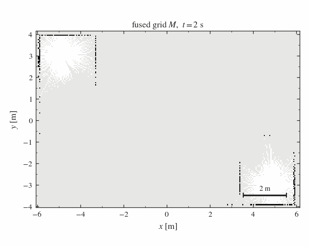
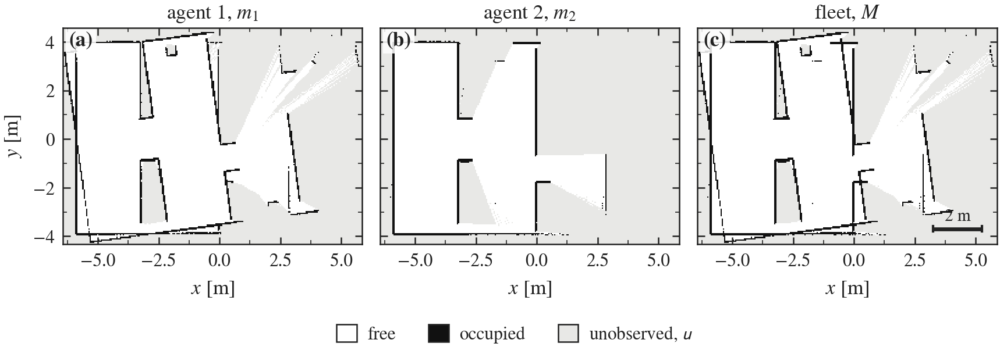
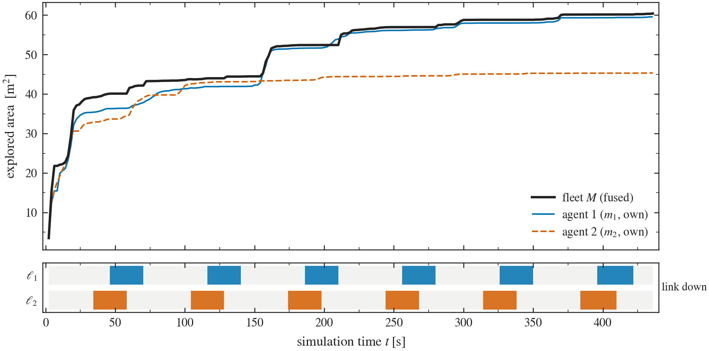

# Collaborative 2D SLAM for a Ground Fleet under Intermittent Connectivity

First implementation iteration. This document specifies the simulated multi-robot
platform, the map fusion operator and the connectivity model that together form
the perceptual substrate on which the epistemic planning layer of the project is
to be built.

---

## Abstract

A fleet of $n$ unmanned ground vehicles explores an unknown planar environment,
each agent running an independent pose-graph SLAM front end over its own laser
observations. Because inter-agent connectivity is intermittent, the fleet-level
map is not the instantaneous union of the individual maps: it is the union of
what has actually been delivered. This iteration implements that distinction
explicitly. Individual occupancy estimates are fused by an idempotent,
order-independent operator over a bounded join-semilattice, and delivery is gated
by a per-agent link process, so that a lost link freezes an agent's contribution
without erasing it. The resulting divergence between what an agent knows and what
the fleet knows is measured directly, and is precisely the asymmetry that the
Dynamic Epistemic Logic layer of this work is intended to reason about.

---

## 1. Problem statement

Let $\mathcal{A} = \{1, \dots, n\}$ index the agents and let $\mathcal{W} \subset
\mathbb{R}^2$ be a bounded, static, initially unknown workspace. Each agent
$i \in \mathcal{A}$ maintains a discrete occupancy estimate

$$m_i : \mathcal{G}_i \to \mathcal{V}, \qquad
\mathcal{V} = \{\,\mathsf{u}\,\} \cup \{0, \dots, 100\},$$

over a regular lattice $\mathcal{G}_i \subset \mathbb{Z}^2$ of resolution
$\rho$, where $\mathsf{u}$ denotes an unobserved cell and the numeric values are
occupancy odds expressed as percentages. Classical SLAM asks each agent to
estimate $m_i$ jointly with its trajectory from its own noisy observations
[[1](#ref1)].

The multi-agent problem adds a second question that the single-agent formulation
cannot express: *what does the fleet know?* Writing $\mathcal{C}(t) \subseteq
\mathcal{A}$ for the set of agents reachable at time $t$, the naive answer

$$M(t) \;=\; \bigoplus_{i \in \mathcal{C}(t)} m_i(t)$$

is wrong, because it makes fleet knowledge non-monotonic: an agent leaving
$\mathcal{C}(t)$ would delete observations the fleet had already received. A
radio link that drops interrupts the arrival of *new* information; it does not
retract information already delivered. Section [3](#3-map-fusion) formalises the
corrected semantics.

This distinction is the concrete, geometric instance of the gap the project
addresses. Collaborative SLAM systems degrade under intermittent connectivity
[[2](#ref2)] precisely because they lack a formalism for representing which
portions of the map are known to which agents and when synchronisation is
warranted.

---

## 2. Platform

### 2.1 Vehicle model

Each agent is a differential-drive UGV whose configuration
$q = (x, y, \theta)^\top \in SE(2)$ evolves under the unicycle constraint

$$\dot{x} = v\cos\theta, \qquad \dot{y} = v\sin\theta, \qquad \dot{\theta} = \omega,$$

with body velocities recovered from wheel rates $(\omega_L, \omega_R)$ as
$v = \tfrac{r}{2}(\omega_R + \omega_L)$ and
$\omega = \tfrac{r}{b}(\omega_R - \omega_L)$.

| Parameter | Symbol | Value |
|---|---|---|
| Wheel radius | $r$ | $0.070$ m |
| Wheel separation | $b$ | $0.300$ m |
| Chassis footprint | — | $0.35 \times 0.28$ m |
| Mass | — | $7.1$ kg |
| Commanded cruise speed | $v$ | $0.22$ m s$^{-1}$ |
| Commanded turn rate | $\omega$ | $0.50$ rad s$^{-1}$ |

Odometry is integrated from the simulated wheel encoders and published as the
transform $\mathsf{odom}_i \to \mathsf{base}_i$; it is subject to the usual
unbounded drift, which the SLAM front end corrects through the
$\mathsf{map}_i \to \mathsf{odom}_i$ transform. Encoder integration is used in
preference to the simulator's ground-truth pose deliberately: the latter would
anchor $\mathsf{map}_i$ at the world origin rather than at the agent's own
starting pose, and would hand the estimator drift-free odometry that no physical
vehicle has.

The commanded velocities are low by design. In-place rotation is the motion that
most degrades correlative scan matching, and rotating hard against a wall slips
the wheels — an error encoder odometry cannot observe and the matcher must
absorb.

### 2.2 Exteroceptive sensing

A planar lidar rigidly mounted on the chassis returns $360$ beams over a full
$2\pi$ field of view at $15$ Hz, with range $[0.15,\, 8.0]$ m and additive
Gaussian range noise of standard deviation $\sigma = 0.01$ m. Beams are cast on
the CPU rather than the GPU so that the platform behaves identically in headless
batch runs and interactive sessions.

### 2.3 Per-agent estimation

Every agent runs an independent asynchronous pose-graph SLAM instance
(`slam_toolbox`, a Karto-derived correlative scan matcher with a sparse
pose-graph back end solved by Ceres). Nodes are inserted on a travelled distance
of $0.20$ m or a heading change of $0.20$ rad; loop closures are searched within
a $3.0$ m radius over chains of at least $10$ nodes. The published grid
resolution is $\rho = 0.05$ m.

Crucially, no agent consumes another agent's scans, poses or pose graph. Coupling
occurs exclusively at the level of published occupancy grids, through the
operator of Section [3](#3-map-fusion). This keeps the estimation layer a
strict per-agent concern and confines all inter-agent semantics to a single,
analysable component.

### 2.4 Frame convention

All agents share one transform tree; disambiguation is by frame prefix rather
than by namespaced trees, so a single global view is well defined.

| Frame | Parent | Source |
|---|---|---|
| $\mathsf{map}$ | — | global reference |
| $\mathsf{map}_i$ | $\mathsf{map}$ | static, from $T_i$ (§3.1) |
| $\mathsf{odom}_i$ | $\mathsf{map}_i$ | SLAM correction |
| $\mathsf{base}_i$ | $\mathsf{odom}_i$ | wheel odometry |
| $\mathsf{laser}_i$ | $\mathsf{base}_i$ | fixed extrinsics |

---

## 3. Map fusion

### 3.1 The fusion operator

Let $T_i \in SE(2)$ be the rigid transform carrying agent $i$'s map frame into
the global frame, and let $\pi_i : \mathcal{G} \to \mathcal{G}_i$ be the induced
lattice correspondence. Define the binary operator $\oplus$ on $\mathcal{V}$ by

$$
\mathsf{u} \oplus x = x, \qquad
x \oplus \mathsf{u} = x, \qquad
x \oplus y = \max(x, y) \quad \text{for } x, y \neq \mathsf{u}.
$$

The fused map is then the cell-wise reduction

$$M(c) \;=\; \bigoplus_{i \in \mathcal{D}(t)} m_i\!\left(\pi_i^{-1}(c)\right),
\qquad c \in \mathcal{G},$$

over the set $\mathcal{D}(t)$ of agents whose maps have been delivered
(Section [3.2](#32-retention-under-link-loss)).

Two properties of $\oplus$ carry the engineering weight.

**Absorption of ignorance.** $\mathsf{u}$ is a two-sided identity, so an agent
that has not observed a cell contributes nothing there. Ignorance never
overwrites knowledge, and unobserved regions of the workspace remain marked
unobserved in the fused map rather than being silently filled.

**Order independence.** $\oplus$ is commutative, associative and idempotent, and
admits the identity $\mathsf{u}$; hence $(\mathcal{V}, \oplus, \mathsf{u})$ is a
bounded join-semilattice. The fused map therefore depends only on the *set* of
delivered grids, not on their arrival order, nor on how many times any grid is
redelivered. Under asynchronous, lossy, duplicating delivery — exactly the
regime this work targets — the fleet map is well defined without any distributed
agreement protocol. This is the geometric counterpart of *distributed knowledge*;
it is worth stating plainly that **common knowledge is not obtainable this way**,
and recovering it is one of the things the epistemic layer must supply.

Where two agents disagree on an observed cell, $\max$ resolves in favour of
occupancy. The choice is deliberately conservative for navigation, and it keeps
disagreement visible as an obstacle rather than averaging it away into free
space.

### 3.2 Retention under link loss

Let $\ell_i(t) \in \{0,1\}$ be the link indicator of agent $i$. The grid that
agent $i$ contributes to the fusion at time $t$ is the most recent one delivered
while its link was up:

$$\tilde{m}_i(t) \;=\; m_i(\tau_i(t)), \qquad
\tau_i(t) \;=\; \sup\{\, s \le t \;:\; \ell_i(s) = 1 \,\},$$

and $\mathcal{D}(t) = \{\, i : \tau_i(t) \text{ exists} \,\}$. An agent that
loses its link therefore *freezes* rather than disappears: its contribution goes
stale and stops tracking its own exploration, but it is not withdrawn from the
fusion. The observable consequence — a plateau in the fused map while a
disconnected agent keeps exploring alone, followed by a step at reconnection —
is visible in Figure [3](#figure-3).

It is worth being precise about what this does *not* establish. Connectivity
alone cannot remove an agent from $\mathcal{D}(t)$, so no cell is lost to a link
drop. But $\tilde{m}_i$ is replaced wholesale on each delivery, and a pose-graph
correction can move or retract cells within an agent's own estimate. Fleet
knowledge is consequently monotone with respect to *connectivity*, not with
respect to time in general:

$$\mathcal{D}(t) \subseteq \mathcal{D}(t') \quad \text{for } t \le t',$$

while $\{\, c : M_t(c) \neq \mathsf{u} \,\}$ may still shrink when an agent's
SLAM back end revises its map. Making fleet knowledge monotone in the strong,
cell-wise sense would require accumulating delivered observations into a
persistent global grid, which in turn requires a principled treatment of how a
retrospective pose correction acts on already-accumulated cells. That is a
genuinely epistemic question — it is belief *revision*, not belief expansion —
and it is deferred to the layer equipped to express it.

---

## 4. Connectivity model

Connectivity is generated by a per-agent duty cycle

$$\ell_i(t) = \mathbb{1}\!\left[\,(t + i\,\delta) \bmod (T_{\mathrm{up}} + T_{\mathrm{down}}) < T_{\mathrm{up}}\,\right],$$

with $T_{\mathrm{up}} = 45$ s, $T_{\mathrm{down}} = 25$ s and phase offset
$\delta = 12$ s. The phase offset is not incidental. A single global on/off
switch would keep every agent in the same informational state at all times,
which is exactly the degenerate case in which epistemic reasoning is unnecessary.
Offsetting the cycles forces the fleet through *partial* connectivity states, in
which agents hold genuinely different information about the same environment —
the regime in which the asymmetries of interest arise.

---

## 5. Experimental evaluation

### 5.1 Scenario

A $12 \times 8$ m warehouse bounded by walls, containing three shelf aisles of
six blocks, with the eastern corridor obstructed by a removable barrier. The
obstruction reproduces the motivating scenario of the proposal: one agent may
observe the blockage while another, disconnected at that moment, does not.

Bay lengths and the position of each lateral passage are irregular, and two
pillars and a chamfered corner break the hall's translational symmetry. This is
not decoration. An evenly spaced array of identical bays is a poor case for scan
matching, since from inside an aisle every column returns much the same scan and
the loop-closure search has little to separate them.

Two agents are deployed at opposite ends of the hall facing inwards, at
$(-5, +3, 0)$ and $(+5, -3, \pi)$. Deploying them together made their coverage
almost entirely redundant, which understates what a fleet is for, and kept them
close enough to spend much of the run observing one another — moving obstacles
that a static-world SLAM front end has no mechanism to reject. The second
deployment pose also exercises the rotational part of $T_i$ in the fusion, which
a fleet of identically oriented agents would leave untested.

Exploration is driven by a reactive laser-based controller with a wall-following
bias, deliberately *not* a deliberative planner: this iteration is concerned with
the perceptual and communication substrate, and a fixed reactive policy keeps the
exploration process constant while the fusion and connectivity semantics are
evaluated. Replacing it is the subject of the planning objective (OE1).

### 5.2 Map construction

**Figure 1.** Evolution of the fused grid $M$ over the run. Black denotes
occupied cells, white free cells, light grey cells still carrying $\mathsf{u}$.
The canvas is fixed to the final extent, so growth of the mapped region is
directly visible rather than being hidden by a moving viewport.

**Figure 2.** Individual estimates $m_1$, $m_2$ and the fused estimate $M$ at the
end of the run, composited onto a common canvas through each grid's own $T_i$.
Panels (a) and (b) are what each agent alone believes; panel (c) is what the
fleet holds. The fused panel is the cell-wise join of the other two and contains
nothing absent from both, which is the defining property of $\oplus$: fusion
propagates observations, it does not synthesise them.

### 5.3 Individual versus fleet knowledge

**Figure 3.** Explored area against simulation time. The heavy trace is the fused
fleet map $M$; the thin traces are each agent's own map. The lower strip is the
link process, one row per agent, with filled intervals marking $\ell_i = 0$. Area
is reported in square metres rather than as a fraction of the canvas, since the
canvas grows with the map and fractions would not be comparable across time.

The quantity of interest is the vertical gap between the fused trace and each
individual trace. It is the geometric measure of what an agent does *not* know
but the fleet does — the epistemic asymmetry that motivates the modal treatment
of the following iterations. During an outage the fused trace stops tracking the
disconnected agent while that agent's own trace continues to climb, and the
accumulated difference is recovered as a step at reconnection.

**Table 1.** Explored area at the end of the run.

| Quantity | Area (m²) | Share of fused map |
|---|---|---|
| Agent 1, own map | *see run output* | — |
| Agent 2, own map | *see run output* | — |
| Fused fleet map | *see run output* | 100 % |

---

## 6. Relation to the epistemic layer

This iteration is deliberately confined to the substrate, and each of its
components has a defined role in the formalism that follows.

- **The fused lattice** is the domain on which the symbolic extraction function
  of OE3 acts. Translating $M$ into propositional atoms over regions is a
  discretisation of an already order-independent structure, which is what makes
  the translation well posed.
- **The link indicator $\ell_i(t)$** is the observable that selects which
  epistemic event applies. A delivery while $\ell_i = 1$ is a public
  announcement in the DEL sense; exploration while $\ell_i = 0$ is a private
  sensing action whose effect on the fleet's knowledge is deferred.
- **The join-semilattice property** establishes distributed knowledge among the
  agents whose grids have been delivered, and no more. Higher-order attitudes —
  what agent $i$ believes agent $j$ knows — have no representation at this
  level, by construction. Supplying them is the substantive content of the DEL
  layer, not an incremental extension of the fusion operator.
- **The individual/fused coverage gap** of Figure [3](#figure-3) is the
  quantitative signal against which the epistemic planner is to be evaluated
  under OE4.

---

## 7. Limitations of this iteration

1. **Known relative initialisation.** The transforms $T_i$ are taken from the
   deployment configuration rather than estimated. Recovering them from
   inter-agent loop closure is the geometric half of collaborative SLAM and is
   not attempted here; the fusion operator is agnostic to their provenance, so
   the substitution is local.
2. **Deterministic fusion.** $\oplus$ acts on occupancy values, not on
   distributions. Cell-wise covariance is discarded, so the fused map carries no
   calibrated confidence. This is consistent with the project's stated scope,
   which restricts epistemic uncertainty to the discrete case.
3. **Reactive exploration.** Agents do not reason about where to go. Exploration
   is a fixed laser-driven policy, and no frontier assignment or task allocation
   is performed.
4. **No symbolic layer.** Neither the EPDDL planner nor the classical PDDL
   baseline required for the comparative evaluation is present in this
   iteration.
5. **Static planar worlds.** Consistent with the declared scope: two dimensions,
   fixed obstacles, two to three agents.

---

## References

[1] H. Durrant-Whyte and T. Bailey, "Simultaneous localization and mapping:
part I," *IEEE Robotics & Automation Magazine*, vol. 13, no. 2, pp. 99–110, 2006.

[2] P.-Y. Lajoie, B. Ramtoula, F. Wu and G. Beltrame, "Towards collaborative
simultaneous localization and mapping: a survey of the current research
landscape," *Field Robotics*, vol. 2, pp. 971–1000, 2022.

[3] S. Macenski and I. Jambrecic, "SLAM Toolbox: SLAM for the dynamic world,"
*Journal of Open Source Software*, vol. 6, no. 61, p. 2783, 2021.

[4] T. Bolander and M. B. Andersen, "Epistemic planning for single- and
multi-agent systems," *Journal of Applied Non-Classical Logics*, vol. 21, no. 1,
pp. 9–34, 2011.

[5] H. van Ditmarsch, W. van der Hoek and B. Kooi, *Dynamic Epistemic Logic*.
Springer, 2008.
