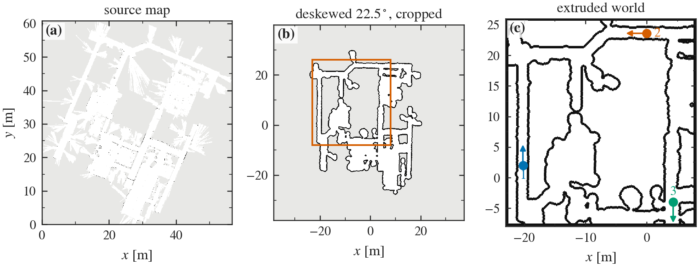
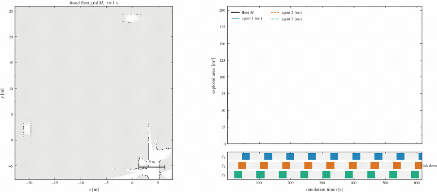
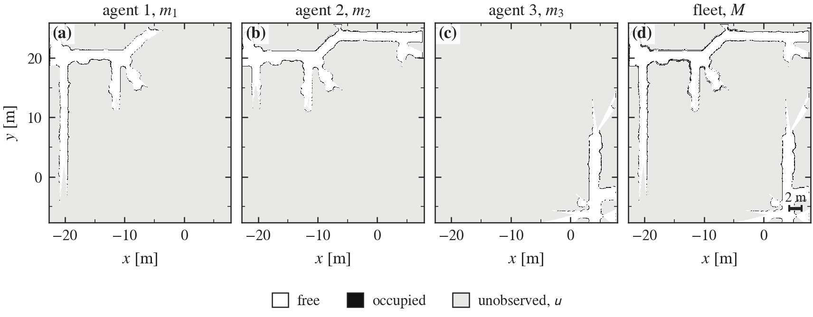
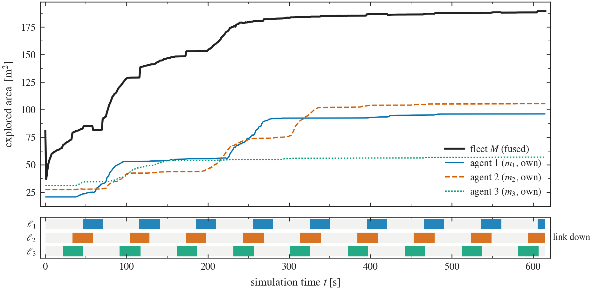

# Second Iteration — a Real Building, Three Agents

Second implementation iteration. The substrate specified in the
[first iteration](../README.md) — the fusion operator $\oplus$, the per-agent
link process $\ell_i(t)$, the per-agent SLAM front end and the reactive
exploration policy — is carried over **unchanged**. What changes is the world
the fleet is placed in and how many agents are placed in it: a synthetic
$12 \times 8$ m warehouse with two agents becomes the floor plan of a real
office building with three.

The question this iteration asks is narrow and deliberately so. The first
iteration's results were obtained in geometry that had been designed, by us,
partly to be favourable to the scan matcher. Do they survive geometry that was
not?

---

## 1. Scenario

### 1.1 Source map

The environment is derived from `willow-2010-02-18-0.10`, a 2D occupancy grid of
the Willow Garage office built by a robot from laser data in February 2010 at
$0.1$ m resolution, distributed with the `turtlebot_navigation` package of
[`turtlebot_apps`](https://github.com/turtlebot/turtlebot_apps) under a BSD
licence. It is retrieved verbatim into `src/mrs_bringup/maps/`; see
[`maps/SOURCE.md`](../src/mrs_bringup/maps/SOURCE.md) for the exact URLs.

The map is used because it is a record of a building rather than a description
of one. Its corridors close into loops, its rooms are unequal, its walls are not
parallel by construction, and none of it was arranged with a scan matcher in
mind. Two consequences are worth stating before any result is read off it.
First, the geometry is already the output of one SLAM system, so the radial
spray at doorways is that robot's laser seeing through them and the apparent
wall thickness varies with how often it looked at a given wall. Second, the map
covers roughly $76 \times 78$ m, which is far more building than three agents at
$0.22$ m s$^{-1}$ can visit in a run of useful length.

### 1.2 From map to world

`tools/map_to_world.py` extrudes the map into an SDF world once, offline; Gazebo
loads the extrusion, never the map. The pipeline and the reason for each step:

| Step | Action | Why |
|---|---|---|
| 1 | Keep only cells the source calls *free* | The probabilistic grey band between free and unknown is mostly range-return spray; thresholding it into obstacles thickens every wall by an amount that varies with observation count |
| 2 | Deskew by $22.5^\circ$ | The map is recorded in the mapping robot's start frame, so the building sits at an angle to the raster. The chosen angle maximises the row/column mass concentration of the free mask. This only picks the world frame, and it lets step 5 cover long walls with few boxes instead of a stair of many |
| 3 | Open ($r = 6$ cells), close ($r = 3$), keep the largest component | Removes the radial spikes where the original laser saw through doorways into unmapped space. Without it those spikes become tunnels out of the building, and the reactive explorer leaves through them |
| 4 | Wall band: non-free cells within $0.4$ m of free space, crop boundary sealed | Extruding *all* non-free cells is correct but wasteful — the unmapped building core is a solid block no laser can see past its surface. The seal has to be withdrawn from the free mask, not merely added to the walls, or the crop leaves severed corridors open |
| 5 | Greedy maximal-rectangle cover, one box link per rectangle | Keeps the collision count in the hundreds rather than the tens of thousands, which matters because the lidar is raycast on the CPU |

<a name="figure-1"></a>



**Figure 1.** Provenance of the scenario. (a) the source map as downloaded, in
its own frame; (b) the same map deskewed and cleaned, with the crop window
marked and the extrusion's wall band drawn in ink; (c) the resulting Gazebo
world, with the three deployment poses and their headings. The convention is the
same in all three panels: ink is obstacle, white is free, grey is unobserved.

The crop is a $31 \times 34$ m window covering the building's corridor ring and
the rooms opening off it. It yields **1372 box links** carrying $169.7$ m$^2$ of
wall and enclosing $358.6$ m$^2$ of free floor, of which $351.8$ m$^2$ is
reachable from the deployment poses. That is $4.4\times$ the navigable area of
the first iteration's warehouse ($\approx 81$ m$^2$). Simulation runs at roughly
$0.5$ real-time factor on 16 cores with three agents, three SLAM instances and
the recorder active.

### 1.3 Deployment

| Agent | $x$ [m] | $y$ [m] | $\theta$ [rad] | Arm of the ring |
|---|---|---|---|---|
| 1 | $-20.2$ | $2.0$ | $+\pi/2$ | west corridor, heading north |
| 2 | $0.0$ | $23.6$ | $\pi$ | north corridor, heading west |
| 3 | $4.3$ | $-4.0$ | $-\pi/2$ | east corridor, heading south |

One agent per arm, for the reason given in the first iteration: agents deployed
near one another duplicate coverage and spend the run observing each other as
moving obstacles, which a static-world SLAM front end has no mechanism to
reject. The three yaws are mutually distinct and none is zero, so every $T_i$ in
the fusion carries a non-trivial rotation — a fleet of identically oriented
agents would leave the rotational part of the operator untested.

### 1.4 What is deliberately unchanged

The fusion operator, the duty-cycle link model ($T_{\mathrm{up}} = 45$ s,
$T_{\mathrm{down}} = 25$ s, phase offset $\delta = 12$ s), the vehicle, the lidar,
the `slam_toolbox` tuning and the reactive wall-following explorer are all
exactly as specified in the first iteration. Nothing was retuned for the new
world. Any difference in the results is therefore attributable to the scenario
and the fleet size, which is the entire point of running it.

---

## 2. The run

$615$ s of simulation, three agents, connectivity cycling throughout.

<a name="figure-2"></a>



**Figure 2.** The run replayed. Left: the fused fleet grid $M$ accumulating, with
each agent's estimated trajectory drawn over it and its current pose marked —
filled while its link is up, hollow while it is down. Right: explored area
against time with a cursor at the frame's own timestamp, over the link strip.
The trajectories are the SLAM estimate, not simulator ground truth: the video
shows what the fleet believes. Also available as
[`fig_run.mp4`](figures/iter2/fig_run.mp4), and as
[`fig_growth.gif`](figures/iter2/fig_growth.gif) for the fused grid alone.

### 2.1 Individual and fleet maps

<a name="figure-3"></a>



**Figure 3.** The three individual estimates and the fused estimate at the end of
the run, composited onto a common canvas through each grid's own $T_i$. Panels
(a)–(c) are what each agent alone believes; panel (d) is what the fleet holds.

The operator behaves as specified. The fused panel is the cell-wise join of the
other three and contains nothing absent from all of them; unobserved regions
stay unobserved rather than being filled; the three rotations in $T_i$ compose
into a single consistent canvas with no visible seam where the agents' maps
meet. On this point the second iteration is a straightforward replication of the
first, at $n = 3$ and on geometry that was not chosen to make it easy.

### 2.2 Coverage

<a name="figure-4"></a>



**Figure 4.** Explored area against simulation time. The heavy trace is the fused
fleet map $M$; the thin traces are each agent's own map. The lower strip is the
link process, one row per agent, with filled intervals marking $\ell_i = 0$. The
excursion in the first two seconds is the merger's warm-up, before every agent
has delivered a first grid, and is not a state of the run.

<a name="table-1"></a>

**Table 1.** State after $615$ s of simulation, three agents, $\approx 36\ \%$
link downtime each. Path lengths are polyline sums over the $2$ s pose samples
and so are lower bounds on the distance actually travelled.

| Quantity | Area [m$^2$] | Share of fused map | Link downtime | Path length [m] |
|---|---|---|---|---|
| Agent 1, own map $m_1$ | $96.2$ | $50.8\ \%$ | $34.5\ \%$ | $107$ |
| Agent 2, own map $m_2$ | $105.5$ | $55.7\ \%$ | $36.5\ \%$ | $100$ |
| Agent 3, own map $m_3$ | $57.0$ | $30.1\ \%$ | $36.2\ \%$ | $110$ |
| Fused fleet map $M$ | $189.4$ | $100\ \%$ | — | — |

---

## 3. Reading of the results

**The fusion semantics replicate.** Order independence, absorption of ignorance
and retention under link loss are properties of the operator, not of the
environment, and the run gives no reason to doubt them at $n = 3$: no agent's
contribution is withdrawn at an outage, and the fused grid composes three
distinct $T_i$ without a visible seam. Fleet knowledge is not monotone in time —
16 of the 540 samples after warm-up show the fused area falling, by up to
$3.7$ m$^2$ — but
that is the phenomenon the first iteration already documents, a pose-graph
correction retracting cells inside an agent's own estimate, and it is if anything
better behaved here than the size of the environment would suggest.

**The coverage result inverts.** In the first iteration the two agents' shares
summed to $100.3\ \%$ of the fused map: their coverage was essentially disjoint,
and the fleet map was very nearly the sum of its parts. Here the three shares sum
to $136.6\ \%$ — the individual areas total $258.7$ m$^2$ against a fused
$189.4$ m$^2$, so $69.2$ m$^2$ of observation, $27\ \%$ of everything the three
agents did, was spent on ground another agent had already covered.

The mechanism is visible in Figure [2](#figure-2) and unmistakable in
Figure [3](#figure-3): agents 1 and 2 converged in the north corridor at
$t \approx 218$ s — passing within $0.31$ m of one another at $t = 268$ s — and
thereafter travelled the same corridors, their maps $m_1$ and $m_2$ converging to
near-copies of each other, while the entire southern and central part of the
building went unvisited. A reactive
wall-following policy has no representation of where the other agents have been,
so nothing in it can prevent this. The near-disjoint partition reported in the
first iteration was, as that document itself says, incidental — an artefact of a
small arena with two agents started at opposite ends. Given room to fail, it
fails.

**Exploration saturates well before the run ends.** The fleet map reaches $90\ \%$
of its final extent at $t = 223$ s and $95\ \%$ at $t = 256$ s; over the last
$200$ s it gains $2.6$ m$^2$. Final coverage is $189.4$ m$^2$ of the $351.8$
m$^2$ reachable, or $53.8\ \%$: the fleet stops exploring not because the
building is explored but because the policy has run out of behaviour. This does
*not* fix the caveat raised in the first iteration — that the individual/fused
gap there was dominated by complementarity rather than by outage dynamics. It
relocates it. The gap here is dominated by *redundancy*, and the outage dynamics
are again second order, because after $t \approx 260$ s there is almost no new
information for an outage to delay.

**What this makes concrete for the epistemic layer.** The first iteration
motivated the planning objective by pointing at an allocation that happened to
be good and calling it accidental. The second exhibits an allocation that is
actively bad, in a building large enough for the cost to be measured: two agents
entrained onto the same trajectory, $27\ \%$ duplicated observation, and half the
workspace unobserved after ten minutes of simulated time with three vehicles.
What a planner needs
in order to avoid this is precisely a representation of what the other agents
already know and of when that knowledge has actually been delivered — which is
what the fused lattice and the link indicator supply, and what a reactive policy
cannot consume.

---

## 4. Limitations

Those of the first iteration are carried over unchanged: known relative
initialisation, deterministic fusion without cell-wise covariance, reactive
exploration with no frontier assignment, no symbolic layer, static planar
worlds. Three are specific to this iteration.

1. **The world is a cleaned reading of the map, not the building.** Deskew angle,
   crop window, morphological radii and wall thickness are all choices made by
   `tools/map_to_world.py`, and different choices give a slightly different
   world. The choices are recorded in the generator's arguments and the world
   file's header, so the world is reproducible, but it is not canonical.
2. **One run.** The reactive policy is stochastic in its turn commitments, so the
   entrainment of agents 1 and 2 is one sample of a distribution, not a
   measured expectation. The claim supported here is that redundancy of this
   magnitude *occurs*, not that it occurs with any particular frequency. A
   proper comparison against the epistemic planner (OE4) needs repeated runs
   with a controlled seed.
3. **Saturation still limits what the link model can be shown to do.** As in the
   first iteration, distinguishing the contribution of outage dynamics from that
   of the exploration policy requires a scenario in which exploration stays
   productive for the whole run. Enlarging the world did not achieve this,
   because the binding constraint turned out to be the policy rather than the
   space.

---

## 5. Reproduction

```bash
# 1. fetch the source map (once)
cd src/mrs_bringup/maps
curl -O https://raw.githubusercontent.com/turtlebot/turtlebot_apps/indigo/turtlebot_navigation/maps/willow-2010-02-18-0.10.pgm
curl -O https://raw.githubusercontent.com/turtlebot/turtlebot_apps/indigo/turtlebot_navigation/maps/willow-2010-02-18-0.10.yaml

# 2. extrude it into the world (once; the world file is checked in)
python3 tools/map_to_world.py --name willow_office \
    --crop -23 -8 8 26 --open 6 --close 3 --band 0.4 \
    -o src/mrs_bringup/worlds/willow_office.world

# 3. build and run, headless, recording
colcon build --symlink-install
source install/setup.bash
ros2 launch mrs_bringup multi_robot_slam.launch.py \
    world:=$PWD/install/mrs_bringup/share/mrs_bringup/worlds/willow_office.world \
    fleet:=fleet_willow.yaml n_robots:=3 \
    gui:=false use_rviz:=false comms_dropout:=true \
    record:=true record_dir:=/tmp/mrs_run_iter2

# 4. figures and video
python3 tools/render_scenario.py -o docs/figures/iter2/fig_scenario.png
python3 tools/render_run.py   /tmp/mrs_run_iter2 -o docs/figures/iter2 --gif-stride 6
python3 tools/render_video.py /tmp/mrs_run_iter2 -o docs/figures/iter2 --stride 2 --fps 15
```

Drop `gui:=false use_rviz:=false` to watch it live; the RViz configuration
carries displays for all three agents.
