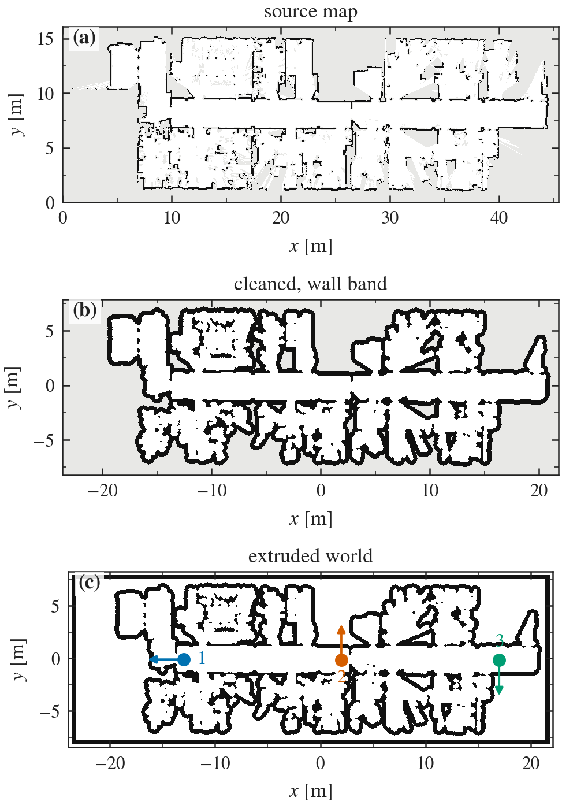
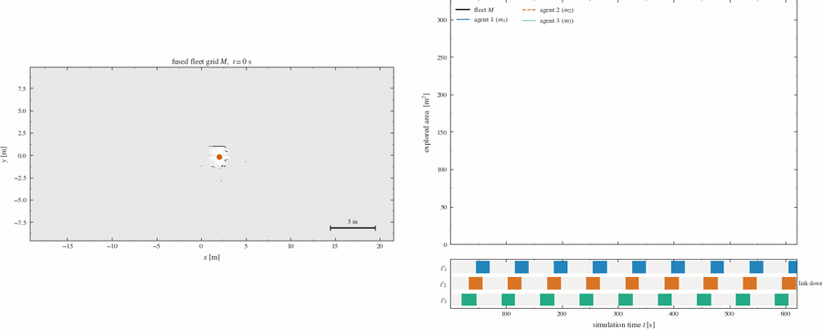
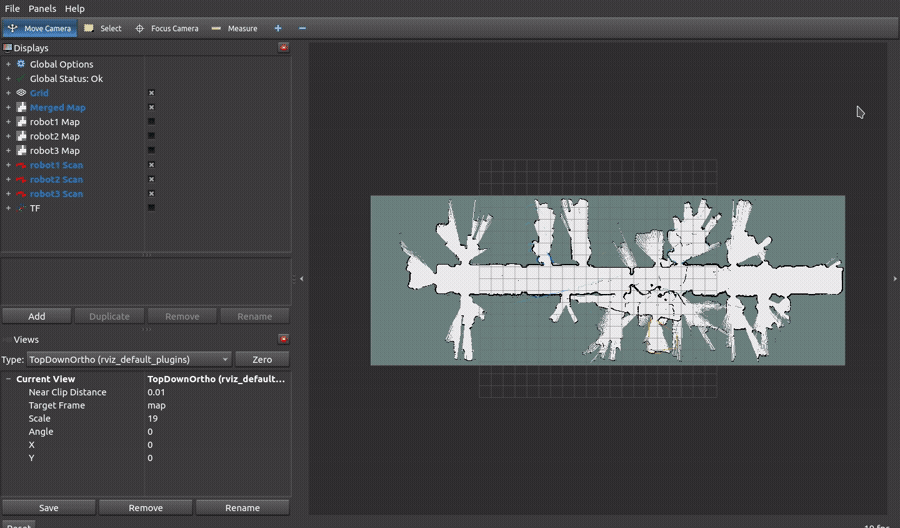
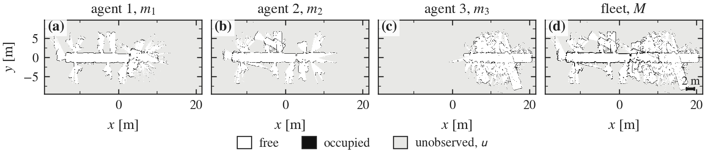
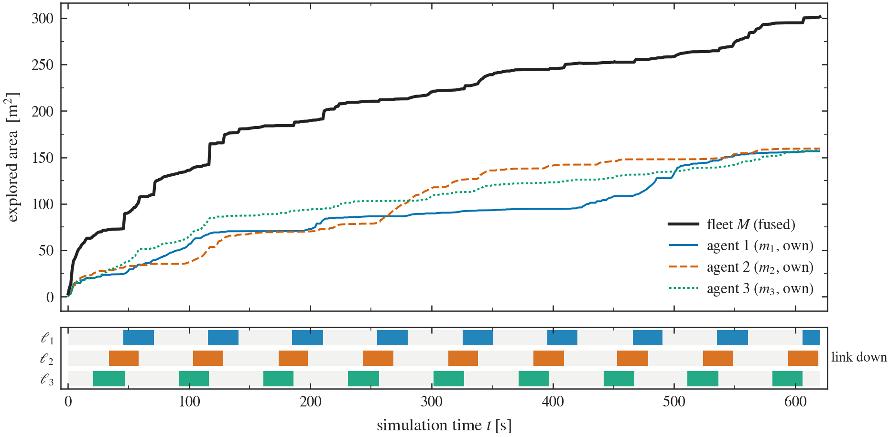
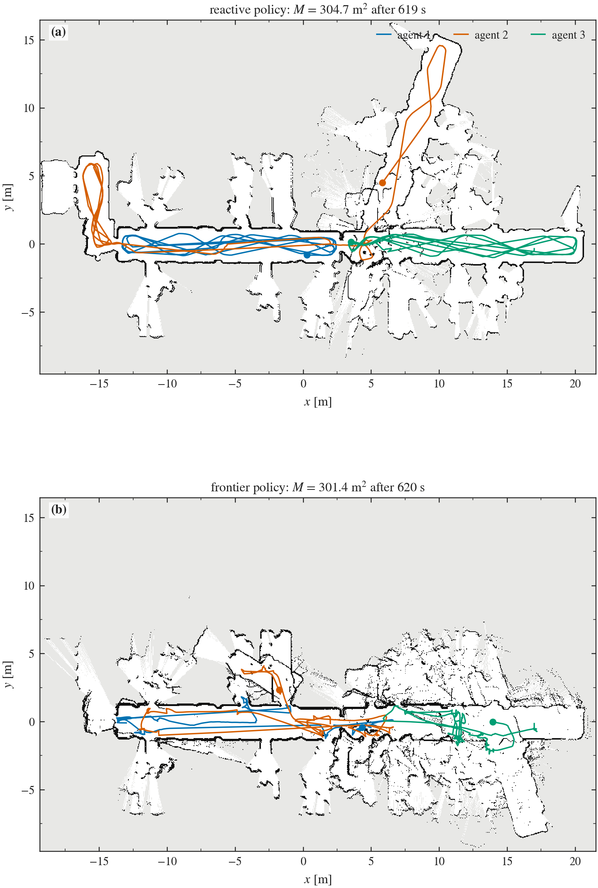
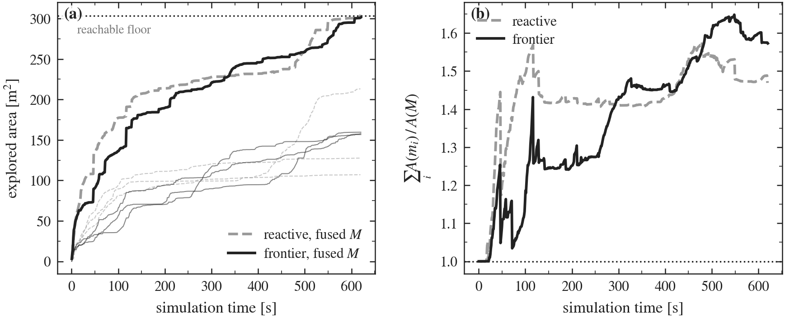
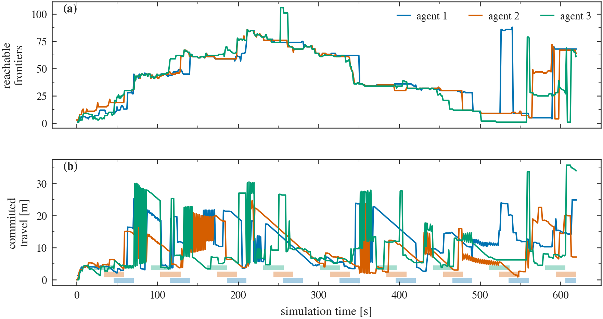

# Third Iteration — Deliberation on the Delivered Map

Third implementation iteration. The substrate specified in the
[first iteration](../README.md) — the fusion operator $\oplus$, the per-agent
link process $\ell_i(t)$ and the per-agent SLAM front end — is again carried
over **unchanged**. What changes is the thing sitting on top of it: the reactive
wall follower that drove the fleet through the first two iterations is replaced
by a deliberative, coordinated frontier planner that plans on the fleet map *as
delivered*, and the two policies are run against each other in the same
building, from the same deployment poses, under the same link process.

The second iteration ended with a measurement and a diagnosis. The measurement:
three agents exploring the Willow Garage floor plan spent $27\ \%$ of all their
observation on ground another agent had already covered, two of the three
entrained onto the same corridor, and half the workspace was still unseen after
ten minutes. The diagnosis: a policy that drives from the laser alone has no
representation of where anybody has been, so nothing in it can prevent this.

This iteration supplies the representation and measures what it buys. It is
deliberately the *classical* answer — frontier exploration [[1](#ref1)] extended
to a fleet by cost-utility scoring with announced goals
[[2](#ref2), [3](#ref3), [4](#ref4)], which is the standard construction of the
multi-robot exploration literature — because that is the baseline the project's
epistemic planner has to beat, and because the point at which the classical
answer degrades is precisely where the epistemic question begins. That point is
reached here, and it is visible in the numbers: what the planner cannot
represent is not where the other agents *are*, but what they have and have not
been *told*.

---

## 1. Scenario

### 1.1 Source map

The environment is the standard `fr079` grid map of building 079 of the
University of Freiburg computer science campus — one long corridor with some
forty offices and labs opening off both sides — from the Robotics Data Set
Repository, in the rendering published with the DynamicVoronoi code of Lau,
Sprunk and Burgard [[5](#ref5)]. `tools/png_to_map.py` quantises that image
into a `map_server` pair at an assumed $0.05$ m per pixel, which makes the
$909 \times 322$ pixel image a $45.5 \times 16.1$ m building; the assumption and
its consequences are recorded in
[`maps/SOURCE.md`](../src/mrs_bringup/maps/SOURCE.md).

The building is chosen for its **topology**, not its size. A corridor spine with
many small rooms hung off it turns exploration into a sequence of discrete,
spatially separated tasks: a room is a unit of work, entering it is a commitment
of a minute or more, and two agents entering the same room is a waste that can
be counted. A corridor ring — the second iteration's Willow Garage map — does
not have this property, because there the work is a continuum and any partition
of it is as good as any other. If an assignment mechanism is to be shown to do
anything, it has to be given a scenario in which assignment is a real decision.

### 1.2 From map to world

The extrusion pipeline of the second iteration is reused verbatim, with two of
its scenario choices simply absent: the map is already axis-aligned, so there is
no deskew ($\texttt{--angle 0}$), and the whole building is extruded, so there is
no crop window. The morphological radii remain, and are tighter here
($\texttt{--open 3 --close 1}$) than on the Willow map for a specific reason:
this building's interior partitions are thin, and a closing wide enough to
bridge a $0.1$ m partition merges the rooms on either side of it into one.

<a name="figure-1"></a>



**Figure 1.** Provenance of the scenario. (a) the published `fr079` image
quantised into free / occupied / unknown; (b) the same grid after opening and
closing, with the wall band the extrusion uses drawn in ink; (c) the resulting
Gazebo world with the three deployment poses and their headings. Ink is
obstacle, white is free, grey is unobserved, in all three panels.

The extrusion yields **3316 box links** carrying $178.3$ m$^2$ of wall and
enclosing $303.1$ m$^2$ of navigable floor. The box count is more than double the
Willow world's for a smaller floor area, which is the price of a building made
of many small rooms: the greedy maximal-rectangle cover has less long straight
wall to amortise over.

### 1.3 Deployment

| Agent | $x$ [m] | $y$ [m] | $\theta$ [rad] | Position on the spine |
|---|---|---|---|---|
| 1 | $-13.0$ | $-0.10$ | $\pi$ | west end, facing along the corridor |
| 2 | $+2.0$ | $-0.15$ | $+\pi/2$ | centre, facing into the north rooms |
| 3 | $+17.0$ | $-0.15$ | $-\pi/2$ | east end, facing into the south rooms |

This building has no corridor ring, so the second iteration's "one arm each" has
no meaning; the agents are instead spaced along the spine at roughly $15$ m
intervals, the largest mutual separation the building admits. Two of the three
start facing a room rather than along the corridor: a deliberative planner is
indifferent to its initial heading, and the reactive baseline it is measured
against should not be handed the corridor for free.

### 1.4 What is deliberately unchanged

The fusion operator, the duty-cycle link model ($T_{\mathrm{up}} = 45$ s,
$T_{\mathrm{down}} = 25$ s, phase offset $\delta = 12$ s), the vehicle, the
lidar and the `slam_toolbox` tuning are all exactly as specified in the first
iteration. The two policies share their locomotion parameters as well —
$0.22$ m s$^{-1}$ forward, $0.5$ rad s$^{-1}$ turning, the same $0.35$ m laser
safety stop — so that a difference between the runs is a difference in
*decisions* and not in speed.

---

## 2. The planner

`mrs_coordination/frontier_planner_node` replaces the reactive explorer
node-for-node: same namespace, same `cmd_vel`, same enable topic. It takes one
extra parameter — the fleet roster — because unlike the reactive policy it
reasons about the other agents. One planning cycle, every $2$ s, is four steps.

### 2.1 Belief assembly

The agent plans on

$$
B_i(t) \;=\; \tilde{M}_i(t) \,\oplus\, m_i(t),
$$

the fleet grid *as last received while this agent's link was up*, joined with
its own current grid under the merger's occupancy-dominant operator: unknown is
absorbed by anything known, and any agent reporting an obstacle beats free
space. The two grids are painted onto a common canvas by forward projection —
source cells scattered into the target rather than the target sampled — so that
a rotated grid acquires no interpolation artefacts.

The gating is the whole point, and it is enforced at the subscription:

```cpp
fleet_map_sub_ = create_subscription<nav_msgs::msg::OccupancyGrid>(
  "/map", map_qos,
  [this](nav_msgs::msg::OccupancyGrid::SharedPtr msg) {
    if (linked_) { fleet_map_ = msg; ++deliveries_; }
    else         { ++withheld_; }
  });
```

Latching the fleet map unconditionally would hand the planner knowledge the
radio never delivered, which is exactly the fiction the project exists to
remove. The two counters are written to the run log, so every claim made below
about what an agent knew is checkable against how many fleet maps it actually
received and how many were withheld from it.

### 2.2 Costmap and wavefront

Write $B_i$ for the belief grid of agent $i$ and $o(c) \in \{-1\} \cup [0,100]$
for the occupancy it assigns cell $c$, with $-1$ denoting the unobserved value
$\mathsf{u}$. For an inflation radius $\rho$ the lethal set and the traversable
set are

$$
\mathcal{L}_\rho \;=\; \bigl\{\, c \;:\; \exists\, c' ,\ o(c') \ge 60
\ \wedge\ \lVert c - c' \rVert \le \rho \,\bigr\},
\qquad
\mathcal{T}_\rho \;=\; \bigl\{\, c \;:\; 0 \le o(c) < 60 \,\bigr\}
\setminus \mathcal{L}_\rho ,
$$

and the inflation is computed as a multi-source breadth-first search in cells,
which at this radius differs from a Euclidean distance transform by less than
one cell.

The radius is $0.16$ m — the *inscribed* radius of the $0.35 \times 0.28$ m
chassis, not the circumscribed one. On a clean costmap the conservative choice
would be right. This grid is scan-matched: walls are smeared by a cell or two
and a $0.9$ m doorway reads narrower than it is, and at $0.28$ m the inflation
seals most of this building's doorways, the wavefront cannot leave the room the
agent is in, and the planner reports the building explored when two thirds of it
has never been seen. The laser safety stop, not the inflation, is what keeps the
vehicle off the walls. This is the single most consequential parameter in the
node and the one most specific to the fact that the map is *estimated*.

One Dijkstra wavefront is then run from the agent's own cell $x_i$ over
$\mathcal{T}_\rho$, yielding the cost-to-go

$$
g_\rho : \mathcal{T}_\rho \to \mathbb{R}_{\ge 0} \cup \{\infty\},
\qquad
\mathcal{R}_\rho(x_i) \;=\; \bigl\{\, c \;:\; g_\rho(c) < \infty \,\bigr\},
$$

with $\mathcal{R}_\rho(x_i)$ the reachable component. One search answers three
questions at once — what is reachable, how far every frontier is, and which way
to walk, by gradient backtracking on $g_\rho$ — which is why the planner runs a
single search per cycle rather than one $A^*$ per candidate goal.

### 2.3 Frontiers and the coordination discount

A frontier cell is reachable free space with an unobserved $4$-neighbour: the
boundary between what the agent believes and what nobody has looked at,

$$
\Phi_\rho \;=\; \bigl\{\, c \in \mathcal{R}_\rho(x_i)
\;:\; \exists\, c' \in \mathcal{N}_4(c),\ o(c') = \mathsf{u} \,\bigr\}.
$$

$\Phi_\rho$ is partitioned into $8$-connected clusters
$f \subseteq \Phi_\rho$; clusters with $\lvert f \rvert < 6$ cells
($0.3$ m of frontier) are discarded as scan-matcher noise, and each survivor is
represented by
$\arg\min_{c \in f} \lVert c - \bar{f} \rVert$, its member nearest its own
centroid $\bar{f}$ — the centroid of a curved frontier need not lie on the
frontier, and the representative must be a cell the wavefront has already proved
reachable.

Each cluster is scored, in the cost-utility form of [[3](#ref3)],

$$
V(f) \;=\; \underbrace{\lambda\, w(f)\, \gamma(f)}_{\text{gain}} \;-\;
             \underbrace{d(f)}_{\text{travel}},
\qquad
\gamma(f) \;=\; \min_{j \neq i} \min\!\left(1, \frac{\lVert f - g_j \rVert}{r_c}\right),
$$

with $w(f) = \lvert f \rvert \,\delta$ the cluster's width in metres,
$\lambda = 12$, $d(f) = g_\rho(f)$ the travel the wavefront measured, $g_j$ the
goal agent $j$ last announced and $r_c = 6$ m,
about the diameter of a room here. The discount $\gamma$ is the entire
collaboration: it removes the value of a frontier somebody else has already said
they are driving to, and pushes two agents apart by about one unit of work and
no further.

Claims travel over the same radio as the maps. An agent publishes its goal only
while its link is up, and accepts an incoming claim only while its own link is
up:

```cpp
if (!linked_ || msg->header.frame_id == robot_name_) { return; }
claims_[msg->header.frame_id] = Point2D{msg->point.x, msg->point.y};
```

so a disconnected agent neither announces where it is going nor hears where
anyone else is going, and keeps acting on whatever it last heard. This is the
mechanism the results section is about.

Three guards keep the argmax from degenerating. A hysteresis factor of $1.15$
holds the current goal unless a candidate is clearly better — without it, the
discount arriving with a claim and the shrinking of a frontier as it is observed
make the argmax oscillate between two rooms and the agent spends the run in the
corridor between them. Frontiers closer than $1.0$ m are not committed to, since
the agent would arrive inside its own goal tolerance before the map had changed.
And a goal the vehicle fails to reach — blocked for $4$ s, or moving less than
$0.35$ m in $12$ s — is abandoned and blacklisted within $1.2$ m for $90$ s,
because a doorway narrower than the map says does not stop being selected just
because the approach failed.

### 2.4 Execution

The optimal path is recovered by gradient backtracking down the wavefront, then
shortcut: repeatedly take the furthest waypoint still in line of sight through
traversable cells. This replaces the staircase of an eight-connected grid path
with the straight segments a differential drive can follow without weaving. A
pure-pursuit controller with a $0.55$ m lookahead follows it, turning in place
when the heading error exceeds $0.7$ rad, under a laser safety stop that has the
last word: the plan is computed on a belief up to one planning period old and
coarser than the laser, and the scan is the authority on what is in front of the
vehicle right now — including the other agents, which the static-world belief
never contains.

Two degenerate states are worth naming because they appear in the logs.
`probe` is the bootstrap: when every frontier is within arm's reach, which is
the state of the world in the first seconds of a run, the agent drives forward
reactively until the belief is large enough to deliberate on. `idle` is the
terminal state: no reachable frontier, the agent stops but keeps planning,
because a fleet map arriving at the next link-up can reopen the problem. An
agent sitting in `idle` while another agent is exploring ground it could have
taken is the classical planner's version of the coordination failure, and it is
what Section 4 measures.

---

## 3. The run

$620$ s of simulation, three agents, connectivity cycling throughout. Everything
in this section is the deliberative policy; the reactive baseline enters in
Section 4.

<a name="figure-2"></a>



**Figure 2.** The run replayed. Left: the fused fleet grid $M$ accumulating,
with each agent's estimated trajectory drawn over it and its current pose marked
— filled while its link is up, hollow while it is down. Right: explored area
against time with a cursor at the frame's own timestamp, over the link strip.
The trajectories are the SLAM estimate, not simulator ground truth: the video
shows what the fleet believes. Also available as
[`fig_run.mp4`](figures/iter3/fig_run.mp4), and as
[`fig_growth.gif`](figures/iter3/fig_growth.gif) for the fused grid alone.

<a name="figure-3"></a>



**Figure 3.** A separate short run seen live through RViz, at $6\times$ speed:
the fused fleet grid as the merger publishes it, the three agents' TF frames and
their laser returns. Where Figure [2](#figure-2) is a reconstruction from
recorded snapshots, this is the fleet's belief as the operator would actually
see it at run time, and the radial spray at the doorways is the lidar seeing
through them exactly as the source map's own spray was.

### 3.1 Individual and fleet maps

<a name="figure-4"></a>



**Figure 4.** The three individual estimates and the fused estimate at the end
of the run, composited onto a common canvas through each grid's own $T_i$.
Panels (a)–(c) are what each agent alone believes; panel (d) is what the fleet
holds.

The fusion operator behaves as in the first two iterations: the fused panel is the
cell-wise join of the other three, contains nothing absent from all of them, and
composes three distinct rotations without a visible seam. Fleet knowledge is
again not monotone in time — 5 of the 597 samples after warm-up show the fused
area falling, by at most $0.6$ m$^2$, against 7 of 617 and $1.2$ m$^2$ under the
reactive policy — and again this is the pose-graph correction retracting
cells inside an agent's own estimate that the first iteration documents.

### 3.2 Coverage

<a name="figure-5"></a>



**Figure 5.** Explored area against simulation time for the deliberative run.
The heavy trace is the fused fleet map $M$; the thin traces are each agent's own
map. The lower strip is the link process, one row per agent, with filled
intervals marking $\ell_i = 0$.

Three quantities are reported for every run in this document, and it is worth
fixing them once. For a grid $m$ let

$$
A(m) \;=\; \delta^2 \,\bigl\lvert \{\, c : m(c) \neq \mathsf{u} \,\}
\bigr\rvert
$$

be its explored area at resolution $\delta = 0.05$ m. With $L_i$ the polyline
length of agent $i$'s estimated trajectory, the fleet's **redundancy** and
**observation efficiency** are

$$
\varrho \;=\; \frac{\sum_{i} A(m_i)}{A(M)} \;\in\; [1, n],
\qquad
\eta \;=\; \frac{A(M)}{\sum_{i} L_i} \quad [\text{m}^2\,\text{m}^{-1}].
$$

$\varrho = 1$ is a perfect partition of the work and $\varrho = n$ is $n$ agents
doing the same work $n$ times; $\eta$ is what the fleet obtained per metre it
drove.

<a name="table-1"></a>

**Table 1.** State at the end of the deliberative run, $620$ s, three agents.
Path lengths are polyline sums over the $2$ s pose samples and so are lower
bounds on the distance actually travelled.

| Quantity | Area [m$^2$] | Share of $M$ | Link downtime | Path [m] | m$^2$ per metre |
|---|---|---|---|---|---|
| Agent 1, own map $m_1$ | $156.6$ | $52.0\ \%$ | $34.7\ \%$ | $71.6$ | $2.19$ |
| Agent 2, own map $m_2$ | $159.6$ | $52.9\ \%$ | $36.1\ \%$ | $77.1$ | $2.07$ |
| Agent 3, own map $m_3$ | $158.0$ | $52.4\ \%$ | $36.7\ \%$ | $60.1$ | $2.63$ |
| Fused fleet map $M$ | $301.4$ | $100\ \%$ | — | $208.8$ | $1.44$ |

The fleet map reaches $301.4$ m$^2$, which is $99.4\ \%$ of the $303.1$ m$^2$ of
navigable floor the extrusion reports. **The building is explored.** That single
fact changes what this iteration can and cannot measure, and Section 4 is
written around it.

---

## 4. The comparison

Two runs, same world, same deployment poses, same link process, same locomotion
limits, differing in one word of the command line.

<a name="figure-6"></a>



**Figure 6.** What each policy did. (a) the reactive baseline, (b) the
deliberative planner, each showing the final fused grid with the three
estimated trajectories drawn over it. The two panels contain almost the same
map. They do not contain the same trajectories.

<a name="figure-7"></a>



**Figure 7.** (a) explored area against time, fused (heavy) and per agent
(thin), baseline dashed and grey, deliberative solid and black; the dotted line
is the navigable floor the extrusion reports. (b) the redundancy $\varrho$
defined in Section 3.2 — $\varrho = 1$ is a perfect partition of the work,
$\varrho = n$ is $n$ agents doing the same work $n$ times.

<a name="table-2"></a>

**Table 2.** The two runs, truncated to their common window.

| Quantity | Symbol | Reactive | Deliberative |
|---|---|---|---|
| Fused area | $A(M)$ | $304.8$ m$^2$ ($100.6\ \%$ of navigable) | $301.4$ m$^2$ ($99.4\ \%$) |
| Fleet path length | $\sum_i L_i$ | $349.1$ m | $208.8$ m |
| Observation efficiency | $\eta$ | $0.87$ m$^2$ m$^{-1}$ | $1.44$ m$^2$ m$^{-1}$ |
| Per-agent shares of $M$ | $A(m_i)/A(M)$ | $35.1 / 69.9 / 42.0\ \%$ | $52.0 / 52.9 / 52.4\ \%$ |
| Redundancy | $\varrho$ | $1.47$ | $1.57$ |
| $t$ at $150$ / $200$ / $250$ m$^2$ | — | $62$ / $130$ / $487$ s | $117$ / $211$ / $410$ s |
| $90\ \%$ of own final extent | — | $515$ s | $549$ s |

Four things are worth reading off this, in decreasing order of how much they
should be believed.

**Both policies explore the whole building, so area does not separate them.**
This is the opposite of the second iteration, where the fleet stopped at
$53.8\ \%$ of the reachable floor because the policy ran out of behaviour. The
`fr079` spine is small enough and connected enough that ten minutes of three
agents at $0.22$ m s$^{-1}$ saturates it either way. Any claim of the form "the
deliberative planner explores more" is unsupported here — and would have been
unsupported in the other direction too, since the reactive run's $100.6\ \%$
merely says the extrusion's navigable-floor figure and the fleet's fused area
are the same number to within their own noise.

**The deliberative planner buys the same map for $40\ \%$ less driving.** $208.8$
m against $349.1$ m, an efficiency ratio
$\eta_{\mathrm{del}}/\eta_{\mathrm{re}} = 1.44/0.87 = 1.66$. This is
the result of this iteration. It is visible in Figure [6](#figure-6) without any
statistics: the reactive trajectories are dense hairballs of repeated
corridor traverses, because a wall follower in a corridor spine keeps meeting
its own path; the deliberative trajectories are direct transits between rooms,
because each transit was the cost term of an argmax. On a battery-limited
vehicle this is the metric that decides whether a building can be covered at
all.

**The work is distributed evenly rather than by accident.** The reactive run's
per-agent shares are $35 / 70 / 42\ \%$ — agent 2 did twice the work of agent 1,
having wandered north out of the spine into the large room at $x \approx 10$
while agent 1 paced the western corridor back and forth. The deliberative run's shares are
$52.0 / 52.9 / 52.4\ \%$: three agents that each took about half the building,
which is what an assignment mechanism is supposed to produce and what no
reactive policy has any means to produce. The spread
$\max_i A(m_i)/A(M) - \min_i A(m_i)/A(M)$ falls from $34.8$ to $0.9$ points.

**Redundancy by area does not improve, and should not have been expected to.**
$\varrho = 1.57$ against $1.47$: the deliberative fleet overlaps slightly
*more*. The
reason is geometric rather than algorithmic. Every room in this building opens
off one corridor, so every agent must traverse the shared spine to reach
anything, and an $8$ m lidar sweeping $360^\circ$ re-observes that spine and
everything visible through the doorways off it each time. Overlap measured in
observed area is therefore dominated by a corridor that cannot be partitioned,
and it is the wrong instrument for this building — which is worth stating
plainly, because it is the instrument the second iteration used and reported
$27\ \%$ duplication with. Travel, not area overlap, is what the coordination
discount actually reduces here.

### 4.1 What the planner had to work with

<a name="figure-8"></a>



**Figure 8.** (a) the number of reachable frontier clusters each agent's own
belief contains, and (b) the travel it has committed to, with each agent's link
outages marked as bars along the bottom.

Panel (a) is the figure this whole iteration was built to produce. The three
traces are three agents' answers to the same question — *how much of this
building is still unexplored?* — computed from the same fusion operator over the
same fleet, and they are frequently different answers.

Let $\nu_i(t) = \lvert \{\, f \subseteq \Phi_\rho(B_i(t)) \,\} \rvert$ be
the number of reachable frontier clusters agent $i$'s belief contains, and
define the fleet's **disagreement**

$$
\Delta(t) \;=\; \max_{i} \nu_i(t) \;-\; \min_{i} \nu_i(t) .
$$

$\Delta$ is a property of the *fleet's knowledge*, not of the building: it is
identically zero for a fleet whose members share a map, and it is bounded below
by nothing at all for one whose members do not.

| Quantity | Symbol | Value |
|---|---|---|
| Mean disagreement | $\overline{\Delta}$ | $11.8$ clusters |
| Largest disagreement | $\max_t \Delta(t)$ | $87$ clusters, at $t = 539$ s |
| Fraction of the run in exact agreement | $\Pr[\Delta = 0]$ | $18.5\ \%$ |
| Mean disagreement, fleet fully connected | $\mathbb{E}[\Delta \mid \ell \equiv 1]$ | $5.9$ |
| Mean disagreement, some link down | $\mathbb{E}[\Delta \mid \ell \not\equiv 1]$ | $14.2$ |
| Fraction of the run fully connected | $\Pr[\ell \equiv 1]$ | $29.7\ \%$ |

The disagreement is not noise and it is not a bug: it is the link process
appearing in the planner's own state. Writing $D_i$ and $H_i$ for the fleet maps
agent $i$ received and had withheld, the run gives
$D_i \in [757, 782]$, $H_i \in [414, 439]$ and a withholding rate

$$
\frac{H_i}{D_i + H_i} \;=\; 0.36 \;=\; \frac{T_{\mathrm{down}}}
{T_{\mathrm{up}} + T_{\mathrm{down}}},
$$

which is the duty cycle's own downtime and no coincidence. Between $t \approx 520$ s and $t \approx 545$ s
agent 1 believes $87$ frontier clusters remain while agents 2 and 3 believe
about $5$ do: agent 1 is holding a fleet map from before its outage, in which
the eastern rooms the others have since finished are still unknown, and it is
planning against that map. Nothing in the node represents this. The planner
treats its belief as *the* state of the world, and the only reason the run does
not end badly is that a stale map makes an agent redundant rather than wrong.

The same staleness applies to the coordination discount. All three agents hold
two claims at all times — the roster is three — but a claim is refreshed only
while the *receiving* agent's link is up, so the age of the claim agent $i$ is
steering around is bounded by its own outage,

$$
\operatorname{age}\bigl(g_j \text{ as held by } i\bigr) \;\le\;
T_{\mathrm{down}} \;=\; 25\ \text{s},
$$

for the $36\ \%$ of the run during which $\ell_i = 0$.
This is the mechanism by which two agents can commit to the same room while both
believing they have deconflicted, and it is exactly the situation a planner that
could represent *"agent $j$ does not know that I have taken this room"* would
handle differently.

### 4.2 Two honest observations about the instrumentation

The `reached` counter — goals whose tolerance the vehicle entered — is **zero**
for all three agents across $620$ s, against $149$–$192$ replans. This does not
mean the agents never got anywhere; it means a goal is almost always superseded
by a better one, or dissolved by the frontier being observed from a distance,
before the vehicle physically arrives within $0.45$ m of it. Frontier goals are
waypoints in a gradient, not tasks that complete, and a counter that assumes
otherwise measures nothing. Reporting exploration progress as *frontiers
reached* would be wrong here; area and travel are the honest metrics.

The relaxed-inflation retry of Section 2.2 fires on $6.5\ \%$, $7.0\ \%$ and
$10.0\ \%$ of the three agents' planning cycles. It is therefore not a rare
rescue from a pathological state but a routine part of planning on a
scan-matched grid in a building with $0.9$ m doorways, and the run before it
existed is the evidence for what happens without it: agent 3 sealed into a
$6.3$ m$^2$ pocket at $t \approx 95$ s, reporting no reachable frontier, and
stationary for the remaining $500$ s of that run.

---

## 5. What this makes concrete for the epistemic layer

The first iteration built the substrate and motivated the planning objective by
pointing at an allocation that happened to be good and calling it accidental.
The second exhibited an allocation that was actively bad and measured what it
cost. The third replaces the policy with the standard remedy and finds that the
remedy works on exactly the axis the classical literature promises — travel,
and the even division of labour — while leaving one thing untouched, and it is
the thing this project exists to address.

**The remedy is real.** $40\ \%$ less driving for the same map, and per-agent
shares of $52 / 53 / 52$ against $35 / 70 / 42$. A planner that consumes the
fused lattice and the other agents' announcements is straightforwardly better
than one that consumes the laser alone, and any claim the epistemic layer makes
must be measured against *this* baseline, not against the reactive policy of the
first two iterations. That is the main deliverable of this iteration and the
reason it exists.

**What the remedy cannot do is represent the delivery itself.** The planner has
exactly two channels through which another agent's existence reaches it — the
fused grid and the claim topic — and both are gated by the same link indicator,
and neither carries any record of *when* what arrived, or of what the other
agent knows about what this agent has done. The consequences are measurable in
the run:

- The three agents disagree about how much of the building remains unexplored on
  $81.5\ \%$ of the run, by $\overline{\Delta} = 11.8$ frontier clusters on
  average and by $87$ at worst; conditioning on connectivity, the ratio
  $\mathbb{E}[\Delta \mid \ell \not\equiv 1] / \mathbb{E}[\Delta \mid \ell \equiv 1]$ is $2.4$.
- Each agent acted on a claim set refreshed only during its own uptime — for
  $36\ \%$ of the run, on announcements up to $25$ s old — while itself
  announcing nothing.
- The planner's state at those moments is indistinguishable, from inside the
  node, from the state in which it has genuinely finished. It cannot tell "there
  is nothing left" from "I have not been told what is left".

In the vocabulary of the epistemic layer: the fusion operator establishes
*distributed knowledge* among the agents whose grids have been delivered, and
the claim topic is a public announcement to whoever was listening. A frontier
planner is a function of the agent's own belief, so it is a function of
first-order knowledge only. Every failure listed above is a failure to represent
higher-order attitudes — what agent $i$ believes agent $j$ knows about the
building and about $i$'s own commitments — which is precisely what the DEL layer
supplies and what no amount of tuning $\lambda$, $r_c$ or the hysteresis can
approximate.

Two concrete requirements for that layer fall out of this run, and they are
worth recording because they were not obvious before it:

1. **Coverage is the wrong headline metric in a saturating environment.** Both
   policies mapped $\approx 100\ \%$ of `fr079` in $620$ s. If OE4's comparison
   is to discriminate, its scenarios must either be large enough not to
   saturate, or be scored on cost — travel, energy, time-to-$x\ \%$ — rather
   than final area. This iteration was designed on the first assumption and
   `fr079` saturated anyway, so its headline metric became travel only after the
   runs were in hand. That is the wrong order to decide a metric in, and it is
   recorded here rather than quietly repaired.
2. **The disagreement itself is the observable to plan against.** The spread in
   Figure [8](#figure-8)(a) is a directly measurable, policy-independent
   quantity that exists only because delivery is intermittent. An epistemic
   planner that reasons about who has been told what should reduce it, or should
   exploit it deliberately; either way it gives the OE4 evaluation a dependent
   variable that is about *knowledge* rather than about geometry, which the area
   and travel metrics are not.

---

## 6. Limitations

The limitations of the first two iterations are carried over unchanged: known
relative initialisation, deterministic fusion without cell-wise covariance, no
symbolic layer, static planar worlds, two to three agents. Four are specific to
this one.

1. **One run per policy.** Both policies are stochastic — the reactive one in
   its turn commitments, the deliberative one through the timing of scan
   matching, claim arrival and the link phase — so every number below is one
   sample, not an expectation. The comparison supports statements of the form
   "this happens and costs this much", not "this happens with this frequency".
   Repeated runs under a controlled seed are a prerequisite for the OE4
   evaluation and are not attempted here.
2. **The scale of the world is an assumption.** The published `fr079` image
   carries no metadata; $0.05$ m per pixel is taken from the dataset's
   distribution and makes the building $45.5 \times 16.1$ m. If that is wrong,
   every metric length in this iteration is wrong by the same factor — though
   every *ratio*, which is what the comparison rests on, is not.
3. **The coordination is claim-based, not allocation-based.** Each agent solves
   its own single-agent problem with a discount applied to frontiers others have
   announced. This is the standard construction, and it is deliberately not a
   joint assignment (Hungarian, auction, or otherwise): a joint assignment would
   need agreement about the set of tasks and the set of bidders, which is
   exactly what intermittent connectivity denies. What is measured here is
   therefore the best a decentralised, announcement-based scheme can do, which
   is the right baseline for a layer whose selling point is reasoning about
   *whether the announcement arrived*.
4. **The inflation radius is doing more work than a parameter should.** Section 4
   documents an agent sealed into a pocket of its own map by an inflation radius
   already reduced to the chassis's inscribed radius, and the relaxed retry that
   recovers it. Both the failure and the recovery are properties of planning on
   a scan-matched grid at $0.05$ m, and neither is a property of the exploration
   policy under test. A costmap that carried the SLAM front end's own
   uncertainty would not need the workaround; the project's scope puts that
   uncertainty out of reach, so the workaround stays and is reported.

---

## 7. Reproduction

```bash
# 1. fetch the source image and quantise it into a map_server pair (once)
curl -O http://www2.informatik.uni-freiburg.de/~lau/dynamicvoronoi/FR079.png
python3 tools/png_to_map.py FR079.png \
    -o src/mrs_bringup/maps/fr079-lau-0.05 --resolution 0.05

# 2. extrude it into the world (once; the world file is checked in)
python3 tools/map_to_world.py --map src/mrs_bringup/maps/fr079-lau-0.05 \
    --name fr079_office --angle 0 --open 3 --close 1 --band 0.4 \
    -o src/mrs_bringup/worlds/fr079_office.world

# 3. build, then run each policy once, headless, recording
colcon build --symlink-install
source install/setup.bash

ros2 launch mrs_bringup iteration3_explore.launch.py \
    record:=true record_dir:=/tmp/mrs_iter3_frontier          # deliberative
ros2 launch mrs_bringup iteration3_explore.launch.py explorer:=reactive \
    record:=true record_dir:=/tmp/mrs_iter3_reactive          # baseline

# 4. figures
python3 tools/render_scenario.py --map src/mrs_bringup/maps/fr079-lau-0.05 \
    --world src/mrs_bringup/worlds/fr079_office.world \
    --fleet src/mrs_bringup/config/fleet_fr079.yaml \
    --angle 0 --crop 0 0 0 0 --open 3 --close 1 --rows \
    -o docs/figures/iter3/fig_scenario.png
python3 tools/render_run.py     /tmp/mrs_iter3_frontier -o docs/figures/iter3 --gif-stride 6
python3 tools/render_video.py   /tmp/mrs_iter3_frontier -o docs/figures/iter3 --stride 2 --fps 15
python3 tools/render_compare.py reactive=/tmp/mrs_iter3_reactive \
    frontier=/tmp/mrs_iter3_frontier -o docs/figures/iter3 --reachable 303.1
```

The two runs differ in one word of the command line. Drop `gui:=false
use_rviz:=false` to watch either of them live; the RViz configuration carries
displays for all three agents, and under the deliberative policy each agent also
publishes its current plan on `/<ns>/plan`.

Figure [3](#figure-3) is a screen recording rather than a rendering, made from
a separate short run with RViz started by hand. It is given its own nested X
server, so that the recording contains the viewer and nothing else of the
desktop:

```bash
# Ogre's hardware GLX path does not survive a nested server; llvmpipe does.
export LIBGL_ALWAYS_SOFTWARE=1
Xephyr :78 -screen 1440x860 -ac -br -noreset &

ros2 launch mrs_bringup iteration3_explore.launch.py gui:=false use_rviz:=false &
sleep 330                     # let the world load and the fleet map something

# capture.rviz is multi_robot.rviz with the TopDownOrtho scale dropped to 19,
# so that all 45 m of the building fit in the viewport
DISPLAY=:78 rviz2 -d capture.rviz --ros-args -p use_sim_time:=true &
sleep 35
# no window manager runs on this display, so the window is placed by hand
for w in $(DISPLAY=:78 xdotool search --onlyvisible ""); do
  DISPLAY=:78 xdotool windowmove $w 0 0 windowsize $w 1440 860
done

ffmpeg -f x11grab -framerate 10 -video_size 1440x860 -i :78 -t 140 rviz.mp4

# 6x, 10 fps, palette-quantised, for a GIF small enough to sit in a repository
ffmpeg -i rviz.mp4 -vf "crop=1440:844:0:0,setpts=PTS/6,fps=10,scale=900:-2,\
split[a][b];[a]palettegen=max_colors=128[p];[b][p]paletteuse=dither=bayer" \
    docs/figures/iter3/fig_rviz.gif
```

`gzclient` was recorded the same way and is *not* included: under llvmpipe in a
nested server it draws its own interface and the simulation clock but never the
world geometry, so the recording shows an empty grid. Panel (c) of Figure
[1](#figure-1) is the ground truth this figure would have shown.

---

## References

<a name="ref1"></a>
[1] B. Yamauchi, "A frontier-based approach for autonomous exploration," in
*Proc. IEEE Int. Symp. on Computational Intelligence in Robotics and
Automation*, 1997, pp. 146–151.

<a name="ref2"></a>
[2] B. Yamauchi, "Frontier-based exploration using multiple robots," in *Proc.
2nd Int. Conf. on Autonomous Agents*, 1998, pp. 47–53.

<a name="ref3"></a>
[3] W. Burgard, M. Moors, C. Stachniss and F. Schneider, "Coordinated
multi-robot exploration," *IEEE Transactions on Robotics*, vol. 21, no. 3,
pp. 376–386, 2005.

<a name="ref4"></a>
[4] R. Simmons, D. Apfelbaum, W. Burgard, D. Fox, M. Moors, S. Thrun and
H. Younes, "Coordination for multi-robot exploration and mapping," in *Proc.
AAAI*, 2000, pp. 852–858.

<a name="ref5"></a>
[5] B. Lau, C. Sprunk and W. Burgard, "Efficient grid-based spatial
representations for robot navigation in dynamic environments," *Robotics and
Autonomous Systems*, vol. 61, no. 10, pp. 1116–1130, 2013. (Source of the
`fr079` rendering used here; the underlying log is C. Stachniss's, distributed
through the Robotics Data Set Repository.)

<a name="ref6"></a>
[6] T. Bolander and M. B. Andersen, "Epistemic planning for single- and
multi-agent systems," *Journal of Applied Non-Classical Logics*, vol. 21, no. 1,
pp. 9–34, 2011.
