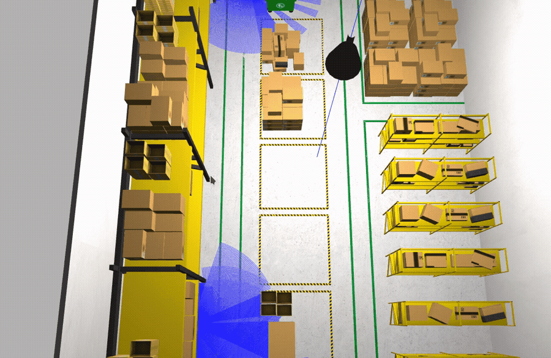

# Task Planning

Symbolic planning for mobile robots, in ROS 2 Humble with
[PlanSys2](https://plansys2.github.io/) and the POPF temporal planner.

This directory is the *deliberative* half of the project. The sibling
[`MultiRobot_ws`](../MultiRobot_ws/README.md) is concerned with what a fleet can
come to know about a building it has never seen — collaborative SLAM, map
fusion, exploration under intermittent connectivity. Here the map is given, the
world is fully observable, and the question is the other one: given a goal
expressed over symbols, what should the robots *do*, in what order, and which
robot should do it?

The two halves meet at the point this directory is ultimately building towards.
Classical planning assumes a single, shared, correct state of the world. A fleet
whose members exchange maps only when a radio link happens to be up does not
have one. Establishing what the classical formulation buys — and precisely where
it stops being applicable — is what the work collected here is for.

## The warehouse showcase



A fleet of ground robots must move crates from storage bays to a shipping dock
in a warehouse of roughly $14 \times 21$ m. Nothing in the problem statement
says which robot serves which crate, or in what order: the allocation and the
schedule are the planner's to discover, which is what makes the same problem
meaningful at one robot and at six.

**Reports.**

- [Single agent](plansys2_showcase_ws/docs/report_single_agent.md) — the
  domain, the roadmap the symbols are grounded in, and one robot executing a
  26-action plan end to end in the simulator.
- [Increasing the fleet](plansys2_showcase_ws/docs/report_multi_agent.md) — the
  same mission at two, three and four robots; what parallelism buys, what it
  costs the planner, and the three modelling failures that had to be corrected
  before any fleet could finish at all.

**The scenario is not synthetic.** The world, its models and its occupancy grid
are the AWS RoboMaker small warehouse, downloaded and used as published; the
vehicle is the standard TurtleBot3 Waffle. The waypoint graph the planner
reasons over is not written by hand either — it is derived from the warehouse's
own occupancy grid, and a waypoint is admitted only if the vehicle's footprint
fits there, an edge only if the straight line between its ends is drivable at
the same clearance. Every `travel_time` in the PDDL problem is a measured
distance divided by the vehicle's cruise speed, so the planner's makespan is
denominated in the same seconds as the wall clock it is later checked against.

---

## What the study establishes

**Deliberation is cheap; execution is not.** Across the fleet sizes run in
simulation, planning takes between $0.3$ and $0.7$ s while execution takes
between three and seven minutes. For problems of this size the planner is not
the bottleneck, and the reflex to optimise it is misplaced.

**Parallelism pays, with diminishing returns that are structural rather than
computational.** Writing $T(n)$ for the time a fleet of $n$ vehicles needs and
$S(n) = T(1)/T(n)$ for the speed-up, three crates give

```math
T = (408.5,\ 285.5,\ 206.0,\ 192.0)\ 	ext{s},
\qquad
S = (1.00,\ 1.43,\ 1.98,\ 2.13),
\qquad
S(n)/n = (1.00,\ 0.72,\ 0.66,\ 0.53).
```

The fourth vehicle is barely used — in that run one robot never moved at all —
because $k = 3$ crates decompose into only $k$ indivisible pick–haul–drop
chains, and because the dock they converge on admits one vehicle at a time. The
makespan is bounded below by the longest such chain and by the dock's
serialisation,

```math
M \;\ge\; \max\Bigl\{\, \max_{c} \chi(c),\ \ k\,\delta_{\mathrm{dock}},\ \Sigma/n \,\Bigr\},
```

so where the curve flattens is a property of the warehouse, not of POPF.

**The planner's cost grows in the fleet, not in the workload.** The ground
action set has size

```math
\lvert A 
vert \;=\; nigl(\lvert W 
vert(\lvert W 
vert - 1)
\;+\; k\,\lvert W 
vert \;+\; k\,\lvert W_{\mathrm{dock}} 
vertigr),
```

linear in both the fleet size $n$ and the workload $k$ — but the search is not.
Sweeping $n$ against $k$ over 36 instances, planning time rises by roughly an
order of magnitude per added robot and eight instances exhaust a two-minute
budget, every one of them with $n \ge 2$; one robot solves ten crates in $2$ s
where two robots solve none in $120$ s. Adding a robot multiplies the branching
at every choice point, adding a crate merely lengthens the plan.

**A temporally consistent plan is not a physically feasible one.** This is the
finding the multi-agent report is organised around, and it took three attempts
to state correctly. The model passed through a strictly increasing chain of
resource invariants,

```math
	ext{(I}_1	ext{)}\ 	ext{one handover per dock}
\ \Longleftarrow	ext{(I}_2	ext{)}\ 	ext{one vehicle per dock}
\ \Longleftarrow	ext{(I}_3	ext{)}\ 	ext{one vehicle per waypoint},
```

each internally consistent, each admitting plans the warehouse rejects, and each
falsified by a robot that stopped half a metre short of where it was supposed to
be: reserving the dock as a *service* still permits two vehicles to stand on it,
and reserving it as a *place* moves the collision one node upstream into the
corridor in front of it. Only (I₃) — single occupancy of every waypoint —
produces schedules the building can accommodate.

**Where this leads.** Space is a resource that classical planning represents
only if the modeller thinks to represent it, and the modeller finds out that
they did not by watching the fleet fail. That is a manageable problem when the
state of the world is shared and correct. The project's next layer removes that
assumption: when what each robot knows depends on when it was last in contact,
the planner needs to reason not only about the warehouse but about what its
colleagues have been told about it.

---

## Environment

ROS 2 Humble, Gazebo Classic 11, PlanSys2 with the POPF plan solver, and the
`turtlebot3_gazebo` models — all from the distribution's own packages. The
warehouse world, its models and its occupancy grid are the
[AWS RoboMaker small warehouse](https://github.com/aws-robotics/aws-robomaker-small-warehouse-world)
(MIT-0), used as published.
