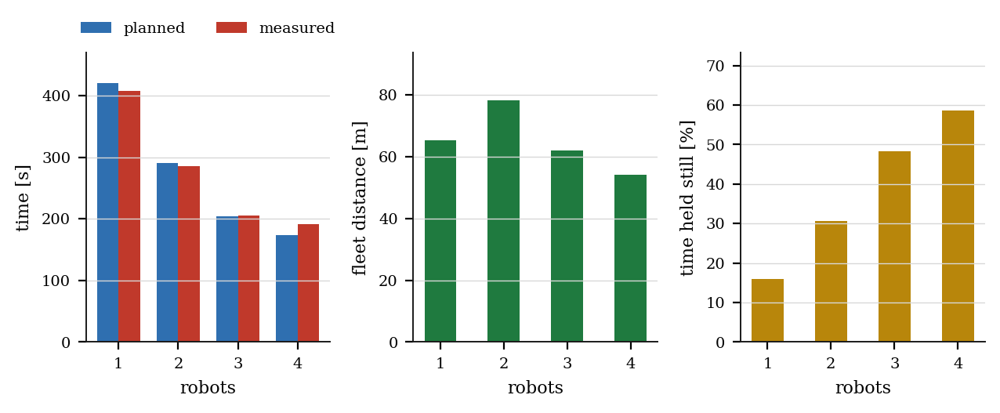
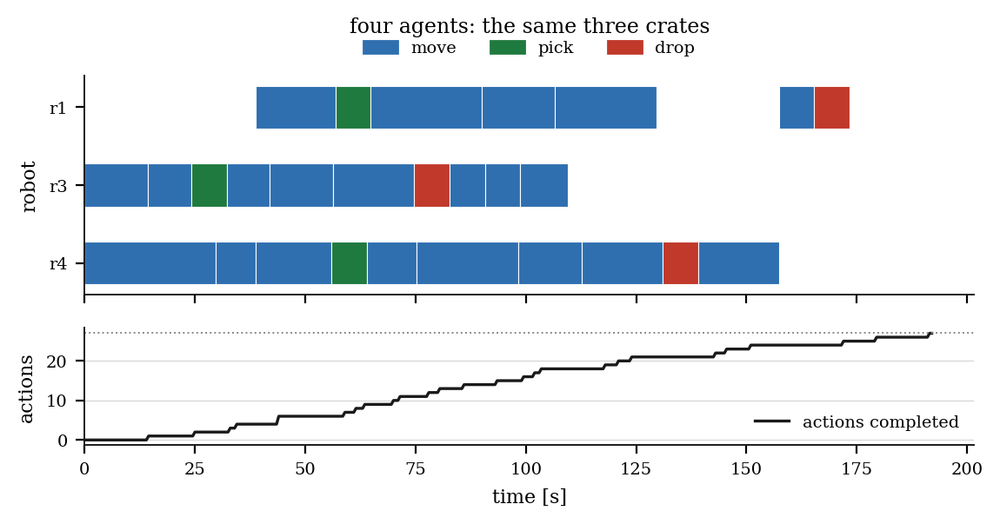
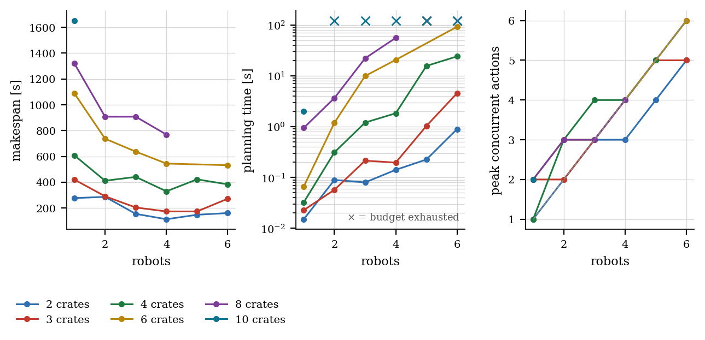

# Adding Robots

Second half of the warehouse showcase. The mission of the
[first report](report_single_agent.md) — three crates from storage bays to the
shipping dock of the AWS RoboMaker small warehouse — is executed again with
fleets of two, three and four vehicles, and the planner is then swept offline
over fleets of one to six against workloads of two to ten crates.

Nothing about the problem changes between runs except the cardinality
$`n = \lvert R \rvert`$. The domain does not mention $n$, the goal
$`g = \bigwedge_{c} \texttt{delivered}(c)`$ names no robot, and the initial state
assigns no crate to anyone. Every difference reported below is therefore
attributable to the fleet size and to what the planner did with it.

Two results emerge, pointing in opposite directions. Parallelism works, with a
ceiling determined by the building rather than by the planner. And the classical
formulation of the problem — the one that made the single-agent run
straightforward — is *incomplete* in a way only a fleet can expose: on three
separate occasions a temporally consistent plan proved physically unrealisable,
and the mission terminated with a vehicle stopped half a metre short of where
its plan placed it.

---

## 1. What a fleet buys

Write $`T(n)`$ for the measured execution time with $n$ robots and
$`M_n = M(\pi_n)`$ for the makespan of the plan it executed. The two standard
figures of merit are the speed-up and the parallel efficiency,

```math
S(n) \;=\; \frac{T(1)}{T(n)},
\qquad
\mathcal{E}(n) \;=\; \frac{S(n)}{n},
```

and, since a fleet buys time with energy, the fleet path length
$`L(n) = \sum_{r \in R} L_r`$ and the stationary fraction
$`\eta_{\mathrm{idle}}(n)`$ defined in the first report.

<a name="table-1"></a>

**Table 1.** The same three-crate mission at four fleet sizes. Every run
completed every action of its plan.

| $n$ | $N$ | $T_{\mathrm{plan}}$ | $M_n$ | $T(n)$ | $T(n)/M_n$ | $S(n)$ | $\mathcal{E}(n)$ | $L(n)$ | $\eta_{\mathrm{idle}}$ |
|---|---|---|---|---|---|---|---|---|---|
| 1 | 26 | $0.28$ s | $420.1$ s | $408.5$ s | $0.97$ | $1.00$ | $1.00$ | $65.5$ m | $15.9\ \%$ |
| 2 | 30 | $0.36$ s | $290.7$ s | $285.5$ s | $0.98$ | $1.43$ | $0.72$ | $78.2$ m | $30.7\ \%$ |
| 3 | 27 | $0.50$ s | $203.9$ s | $206.0$ s | $1.01$ | $1.98$ | $0.66$ | $62.1$ m | $48.3\ \%$ |
| 4 | 27 | $0.63$ s | $173.3$ s | $192.0$ s | $1.11$ | $2.13$ | $0.53$ | $54.2$ m | $58.7\ \%$ |

<a name="figure-1"></a>


**Figure 1.** A four-vehicle mission in the AWS warehouse, Gazebo Classic at
$4\times$ speed, seen from above the floor because the building has walls and no
roof. Each robot is driven by its own `move` performer, specialised on its own
name, and none of them knows what the others were assigned: the division of
labour is entirely POPF's, recovered from a goal that mentions no robot. This
particular run — $27$ actions, planned in $0.40$ s, executed in $177.5$ s —
employs three of the four vehicles, for the reason Figure
[3](#figure-3) makes explicit.

<a name="figure-2"></a>



**Figure 2.** Left: predicted makespan against measured execution time. Centre:
total distance driven by the fleet. Right: the share of fleet-time spent
stationary.

### 1.1 The ceiling is structural

Efficiency falls monotonically from $1.00$ to $0.53$. The ceiling is not the
planner's: three elementary lower bounds on any plan for this problem already
account for most of it.

Each crate $c$ must be picked, hauled and dropped by *one* robot, and those
three actions are totally ordered, so the plan contains a chain of duration

```math
\chi(c) \;=\; t_{\mathrm{pick}} \;+\; \tau^{*}\bigl(b_c, \mathrm{dock}\bigr)
              \;+\; t_{\mathrm{drop}} ,
```

which no amount of parallelism can shorten. With the three bays used here,
$`\chi = 88.7,\ 76.0,\ 58.5`$ s, so

```math
\textbf{(B1)} \qquad M_n \;\ge\; \max_{c} \chi(c) \;=\; 88.7\ \text{s}
\quad \text{for every } n .
```

The dock is a unit-capacity resource under invariant (I) of the first report, and
each delivery occupies it for the approach, the handover and the departure, so
with $k$ crates and a single dock in use

```math
\textbf{(B2)} \qquad M_n \;\ge\; k\,\bigl(\tau(\cdot,\mathrm{dock})
      + t_{\mathrm{drop}} + \tau(\mathrm{dock},\cdot)\bigr)
      \;=\; 3 \times 24 \;=\; 72\ \text{s} .
```

And the total action time $`\Sigma(\pi) = \sum_i d_i`$ cannot be compressed below
its even division,

```math
\textbf{(B3)} \qquad M_n \;\ge\; \frac{\Sigma(\pi)}{n} .
```

At $n = 4$, $`\Sigma = 366.9`$ s gives $`M_4 \ge 91.7`$ s, so the binding bound is
(B3) and the achieved $M_4 = 173.3$ s exceeds it by a factor of $1.9$. The
residual gap is assignment granularity: a crate is served end-to-end by one
vehicle, so the work is divisible only into $k = 3$ indivisible chains, and a
fourth robot has nothing to take. **The curve flattens where the problem stops
being divisible, not where POPF stops being clever.**

### 1.2 The predictions degrade in a specific direction

The fidelity ratio $`T(n)/M_n`$ runs $0.97,\ 0.98,\ 1.01,\ 1.11$. One and two
robots finish ahead of plan, three lands on it, four overruns by $11\ \%$. The
model of driving is exact — an edge is a distance over a speed — but the model
of *sharing* is the token of invariant (I), and a token records that a waypoint
is occupied without recording that the robot waiting for it is itself standing
somewhere, in someone else's way. The excess $`T(n)/M_n - 1`$ is the price of
that abstraction, and it is increasing in $n$.

### 1.3 The fleet drives less, and idles more

$L(n)$ falls from $65.5$ m to $54.2$ m: with one vehicle every crate costs the
full return term of the first report's tour expression, whereas with several the
crates are served by whichever robot began nearest. Distance therefore keeps
improving after makespan has stopped, and a fleet sized on $M_n$ alone would be
over-bought.

The cost appears instead in $`\eta_{\mathrm{idle}}`$, which rises from
$15.9\ \%$ to $58.7\ \%$. The single-agent value is the manipulation floor
$`k(t_{\mathrm{pick}} + t_{\mathrm{drop}})`$; everything above it is waiting —
for a waypoint token, for the dock, for a corridor to clear.

<a name="figure-3"></a>



**Figure 3.** The four-robot schedule, one lane per robot. There are only three
lanes: **the fourth vehicle appears nowhere in the plan.** Robot $`r_2`$ was
declared, spawned, and never dispatched an action; it drove $0.006$ m in the
entire run. With $k = 3$ indivisible chains and $n = 4$, POPF declined to invent
work — a more honest answer than a plan that moves a vehicle so the fleet looks
busy.

---

## 2. What a fleet costs the planner

The embodied runs answer *does this work?* for four configurations; they are far
too slow to answer *what happens as the fleet grows?* That question is settled
offline by `warehouse_tools/plan_benchmark`, which sweeps $n$ against $k$ on the
same domain, the same roadmap and the same POPF binary PlanSys2 invokes, with a
$120$ s budget per instance.

The reason to expect trouble is combinatorial. The ground action set has
cardinality

```math
\lvert A \rvert
\;=\; \underbrace{n\,\lvert W \rvert\,(\lvert W \rvert - 1)}_{\texttt{move}}
\;+\; \underbrace{n\,k\,\lvert W \rvert}_{\texttt{pick}}
\;+\; \underbrace{n\,k\,\lvert W_{\mathrm{dock}} \rvert}_{\texttt{drop}}
\;=\; n\bigl(552 + 24k + 2k\bigr),
```

so $`\lvert A \rvert`$ is linear in both $n$ and $k$ — $630n$ at $k = 3$ — while
the search space over which POPF looks for a schedule is exponential in the plan
length and in the number of interacting resources. Adding a crate lengthens the
plan; adding a robot multiplies the branching at every choice point *and*
introduces $`\binom{n}{2}`$ new ways for the invariant (I) tokens to interact.

<a name="figure-4"></a>



**Figure 4.** 36 instances, $`n \in \{1,\dots,6\}`$ against
$`k \in \{2,3,4,6,8,10\}`$. Left: makespan. Centre: planning time on a
logarithmic scale, crosses marking instances that exhausted the budget. Right:
peak concurrency $`\max_t c(t)`$ against the diagonal a perfectly parallel plan
would follow.

<a name="table-2"></a>

**Table 2.** $`T_{\mathrm{plan}}`$ in seconds; **t/o** is a $120$ s timeout.

| $k$ \ $n$ | 1 | 2 | 3 | 4 | 5 | 6 |
|---|---|---|---|---|---|---|
| 2 | $0.02$ | $0.09$ | $0.08$ | $0.14$ | $0.23$ | $0.90$ |
| 3 | $0.02$ | $0.06$ | $0.21$ | $0.20$ | $1.03$ | $4.55$ |
| 4 | $0.03$ | $0.31$ | $1.20$ | $1.83$ | $15.6$ | $24.1$ |
| 6 | $0.07$ | $1.20$ | $9.90$ | $20.6$ | **t/o** | $92.1$ |
| 8 | $0.95$ | $3.66$ | $22.1$ | $55.8$ | **t/o** | **t/o** |
| 10 | $1.99$ | **t/o** | **t/o** | **t/o** | **t/o** | **t/o** |

**Deliberation is cheap until abruptly it is not.** Eight of the 36 instances
exhausted the budget and every one has $n \ge 2$. Along the $k = 8$ row,
planning time grows by roughly an order of magnitude per added robot —
$0.95,\ 3.7,\ 22,\ 56$ s — whereas along the $n = 1$ column it grows
sub-linearly in $k$, from $0.02$ s at two crates to $1.99$ s at ten. One robot
solves ten crates in two seconds; two robots cannot solve the same ten crates in
two minutes. **Fleet size, not workload, is what makes classical temporal
planning expensive here.**

**The frontier is not monotone, which is reported rather than smoothed.** Six
robots solve $k = 6$ in $92$ s while five robots time out on the same instance.
POPF's search is not monotone in problem size: a larger fleet can present an
easier schedule to find. A benchmark that reported the expected smooth surface
instead of the measured one would be an illustration, not a measurement.

**Parallel plans buy time with energy.** At $k = 6$ the fleet's total drive time
rises from $992$ s at $n=1$ to $1729$ s at $n=6$ — a factor of $1.74$ — while
$`M_n`$ falls from $1088$ s to $532$ s, a factor of $0.49$. The exchange
worsens with every vehicle, and the load spreads unevenly: in the six-robot plan
the least-used robot was busy $128$ s against the busiest robot's $417$ s.

**Concurrency saturates below the diagonal.** With $k = 3$, peak concurrency
reaches four and stops however many robots are offered: at most $k$ deliveries
can be in flight, and the dock admits one vehicle. This is bound (B1)–(B2) seen
from the other side.

---

## 3. Three ways a valid plan was impossible

The single-agent mission succeeded on the first attempt. No multi-robot mission
did. The three failures were not defects of the executor — it did exactly what
it was told — but three successive discoveries that the *model* omitted a
constraint that only becomes observable when two vehicles share a floor.

Formally, each stage strengthens the resource invariant. Write $`s(t)`$ for the
state at time $t$ and $`\mathrm{occ}(w,t)`$ for the set of robots at $w$:

```math
\begin{aligned}
\text{(I}_1\text{)} \quad & \forall t,\ \forall d \in W_{\mathrm{dock}}:
  && \bigl\lvert \{\, r : r \text{ is handing over at } d \,\} \bigr\rvert \le 1, \\
\text{(I}_2\text{)} \quad & \forall t,\ \forall d \in W_{\mathrm{dock}}:
  && \lvert \mathrm{occ}(d,t) \rvert \le 1, \\
\text{(I}_3\text{)} \quad & \forall t,\ \forall w \in W:
  && \lvert \mathrm{occ}(w,t) \rvert \le 1,
\end{aligned}
```

with $`\text{(I}_1) \Leftarrow \text{(I}_2) \Leftarrow \text{(I}_3)`$: each is
strictly weaker than its successor, each admits plans the world rejects, and
each was falsified by a robot stopping short.

### 3.1 The corridor: two robots, both waiting

The first two-robot run failed after $223$ s with $15$ of $24$ actions complete.
Robot $`r_1`$ was executing $`\texttt{move}(r_1, \texttt{c\_s}, \texttt{c\_se})`$
while $`r_2`$ executed $`\texttt{move}(r_2, \texttt{c\_s}, \texttt{dock\_a})`$;
they met in the southern corridor and each halted for the other. The performer's
rule — hold still when the laser returns something ahead — is correct for a
warehouse whose only moving obstacles are colleagues and fatal when the colleague
applies the same rule. Both waited until $`r_1`$'s action reached its timeout,
$2.52$ m short of its goal.

The plan was not wrong: the two `move` actions carried no mutual ordering
because nothing in the domain made the corridor a resource. The remedy at this
level is executor policy — after $6$ s blocked, reverse and turn aside, to a
side selected by a hash of the robot's name so that two vehicles facing each
other choose opposite ways rather than mirroring into a second deadlock. It
treats the symptom, and is documented as such.

### 3.2 The dock as a service rather than a place

With yielding in place, every fleet size instead failed within a metre of the
dock: $0.58$ m short at $n=2$, $0.47$ m at $n=3$, $0.49$ m at $n=4$.

The domain had encoded (I₁): a `dock_free` token taken and returned by `drop`,
serialising the handovers. Two robots could therefore satisfy
$`\texttt{robot\_at}(r_1,d) \wedge \texttt{robot\_at}(r_2,d)`$ simultaneously —
consistent in the model, impossible on a floor one vehicle wide. The second
vehicle drove at an occupied slot and stopped against its bumper.

Enforcing (I₂) required taking the token on *entry* and returning it on *exit*,
which in turn required a `dock` subtype and dedicated `enter_dock` / `leave_dock`
actions, since a generic `move` cannot express "this destination admits one
vehicle".

### 3.3 The queue in front of the dock

(I₂) fixed $n = 2$ and displaced the failure one node upstream. At $n = 3$ and
$n = 4$ the collision reappeared at `c_sw`, the corridor node adjacent to the
dock, where vehicles awaiting their turn had queued — a node the model still
treated as having unbounded capacity.

The general statement is (I₃): unit capacity is a property of *every* waypoint,
not of the ones that happen to be interesting. It is enforced by the `wp_clear`
token of the first report, taken when a vehicle *commits* to a destination
rather than on arrival — otherwise two robots drive at the same node and discover
the conflict with their bumpers — and released when it has actually left. Under
(I₃) the `dock` subtype and its two special actions became redundant and were
deleted: the general constraint subsumes the special case. All four fleet sizes
then completed every action of their plans, which is the state Table 1 reports.

### 3.4 What the sequence means

Each formulation was internally consistent, produced valid plans, and was
refuted by a vehicle half a metre from where it should have been. The
progression generalises beyond warehouses.

- **A classical model represents what the modeller thought to represent.** The
  dock's *service* capacity was modelled immediately, because a service is
  obviously shared. Its *floor* was not, because floors are not usually thought
  of as resources at all — until two robots want the same one.
- **A single agent cannot falsify a multi-agent model.** Every invariant above
  is vacuous at $n = 1$: (I₃) never binds, and the first report's $3\ \%$
  agreement between plan and execution says nothing whatever about the model's
  adequacy for a fleet.
- **The failures were diagnosable because the durations were metric.** "Timed
  out $0.47$ m short of `dock_a`" localises a modelling error; "action failed"
  does not. Grounding $W$ and $E$ in the map is what reduced three modelling
  errors to three afternoons.

---

## 4. Reading of the results

**Sizing a fleet.** In this warehouse, for this workload, the second and third
vehicles earn their place and the fourth does not: $`\mathcal{E}(3) = 0.66`$
against $`\mathcal{E}(4) = 0.53`$, with $`S(4) - S(3) = 0.15`$. That conclusion
is a property of the building and of $k$ — bounds (B1)–(B3) would move with a
second dock or a longer order book. What transfers is the method: the makespan
curve flattens where a physical resource or the divisibility of the work
saturates, and the offline sweep locates that point far more cheaply than the
simulator.

**Choosing a planner.** At the scale a warehouse of this size actually operates,
POPF is not the bottleneck: $`T_{\mathrm{plan}} \le 0.63`$ s against
$`T(n) \ge 192`$ s, a ratio below $0.4\ \%$. It becomes the bottleneck as soon
as $n > 4$, and it fails abruptly rather than gracefully. A deployment that
plans once per shift is comfortable; one that replans on every order arrival
with six vehicles is not, and would need either per-robot decomposition or a
planner that does not ground the full cross product.

**For the project this belongs to.** Classical planning presumes a single,
shared, correct world state. This study measures what that presumption buys —
a fleet dividing work it was never told how to divide, at $`S(3) = 1.98`$ — and
what maintaining it costs: the model must be complete about physical resources,
and it is a fleet in a simulator, not a proof, that reveals when it is not.

The next layer removes the presumption. Under intermittent connectivity no robot
holds the shared state that (I₃) presupposes: a vehicle that has not heard from
its colleagues cannot know whether $`\texttt{wp\_clear}(d)`$ holds, and a planner
that assumes it can is committing exactly the class of error catalogued in
Section 3 — one level up, in knowledge rather than in space.

---

## 5. Limitations

1. **One run per configuration.** Table 1 is four samples, not four
   distributions. The ordering of the makespans is robust because the plans are
   deterministic, but the $11\ \%$ overrun at $n = 4$ is a single measurement.
2. **$k = 3$ is a small workload.** Small enough that four robots saturate it,
   which is what makes the ceiling visible, but a study of assignment *quality*
   would need $k \gg n$ so that the allocation has room to be good or bad.
3. **The yield behaviour is a workaround with free parameters.** Six seconds
   blocked before yielding, three seconds of yielding, a side chosen by hash.
   These were set once and not tuned, but they are executor policy standing in
   for something the plan should arguably specify.
4. **Edges are not resources.** (I₃) constrains vertices only; the model permits
   two robots to traverse the same edge in opposite directions provided their
   endpoints differ. The missing invariant is
   $`\forall t,\ \forall e \in E: \lvert \mathrm{occ}(e,t) \rvert \le 1`$, and
   that the runs nevertheless completed is a property of this warehouse's
   corridor widths rather than a guarantee.
5. **The timeouts are POPF's.** A different temporal planner would place the
   cliff elsewhere. What the sweep supports is the shape — cost driven by $n$
   rather than $k$ — not the precise location of the boundary.
