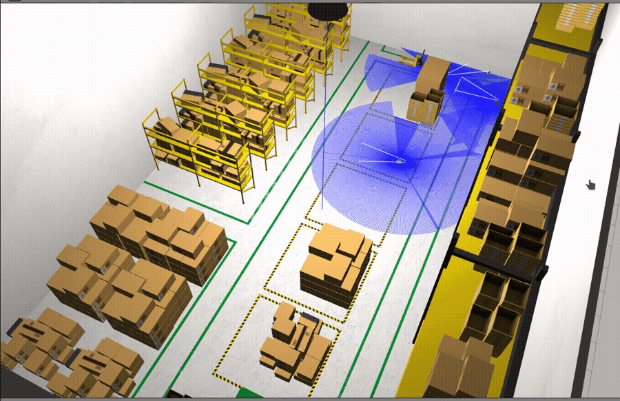
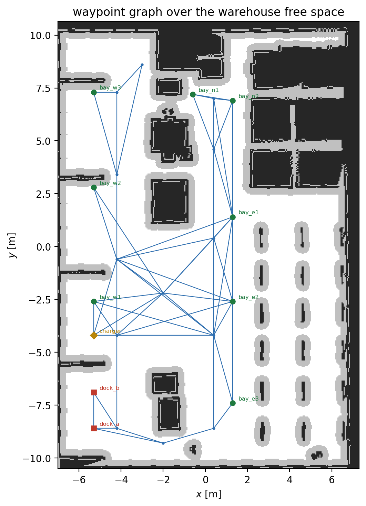
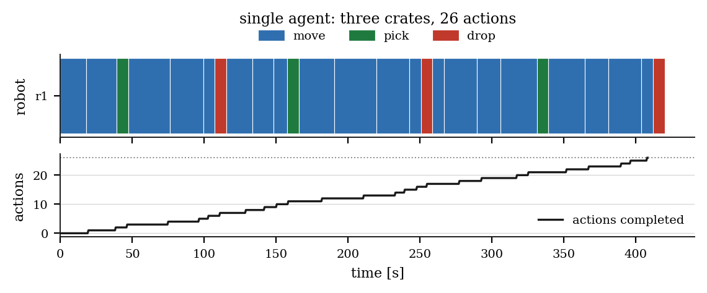

# One Robot, One Plan

First half of the warehouse showcase. A single TurtleBot3 Waffle is asked to
bring three crates from storage bays to the shipping dock of the AWS RoboMaker
small warehouse. It is given no route, no order and no assignment: it is given a
goal expressed over symbols, and everything else is the planner's.

The purpose of a single-agent run is not the result — one robot performing three
errands is not a hard planning problem — but the *correspondence*: between a
PDDL symbol and a position on a floor, between a `:duration` in a domain file
and seconds on a wall clock, between what the planner predicted and what the
simulator did. Establishing that correspondence, and quantifying where it holds,
is what makes the multi-agent study in the [second report](report_multi_agent.md)
interpretable; without it, a fleet that finishes sooner demonstrates only that
the numbers changed.

---

## 1. Scenario

### 1.1 Warehouse

The environment is the AWS RoboMaker small warehouse world, used as published:
27 model instances — shelving, racking, pallets, a ground plane and walls — over
roughly $14 \times 21$ m of floor, together with the occupancy grid distributed
with it. Nothing about it was arranged for this study, which is precisely why it
is used. Its aisles are the width its shelving makes them, and its open floor is
dominated by pallet stacks into which no waypoint may be placed.

<a name="figure-1"></a>



**Figure 1.** The world the fleet runs in, seen in Gazebo Classic at $4\times$
speed: a TurtleBot3 Waffle driving the aisle with its laser returns drawn in
blue. Every measurement in both reports is taken on this simulation.

### 1.2 Grounding the symbols

Let the map be an occupancy grid

```math
m : C \longrightarrow \{\,\mathsf{free},\ \mathsf{occupied},\ \mathsf{unknown}\,\},
\qquad C \subset \mathbb{Z}^2 ,
```

with resolution $\delta = 0.05$ m and the usual affine embedding
$`\xi : C \to \mathbb{R}^2`$ of cells into the world frame. Write
$`\mathcal{F} = \{\,\xi(c) : m(c) = \mathsf{free}\,\}`$ for the free set and

```math
d(p) \;=\; \inf \{\, \lVert p - q \rVert : q \in \mathbb{R}^2 \setminus \mathcal{F} \,\}
```

for the clearance of a point $p$, computed by a chamfer distance transform over
the occupied set.

A task planner's symbols are worth exactly as much as their correspondence with
this function. The usual way to destroy that correspondence is to write the
waypoints and the `connected` relation by hand: a waypoint ends up inside a
shelf, or two waypoints are declared adjacent through a wall, and the resulting
plan is valid and physically impossible.

`warehouse_tools/roadmap_builder` therefore *derives* the roadmap
$`G = (W, E)`$ from $m$. Candidate stations are chosen by hand — they carry the
semantic content of the scenario, and no map can supply them — but each is
admitted only if it satisfies

```math
W \;=\; \bigl\{\, w \in \hat{W} \;:\; d(w) \ \ge\ r \,\bigr\},
\qquad r = 0.32\ \text{m},
```

with $r$ the vehicle's inscribed radius plus one cell of margin, and an edge is
admitted only if the whole segment clears the same radius:

```math
E \;=\; \bigl\{\, \{u,v\} \subset W \;:\;
\lVert u - v \rVert \le \ell_{\max}
\;\wedge\;
\min_{\lambda \in [0,1]} d\bigl((1-\lambda)u + \lambda v\bigr) \ge r \,\bigr\},
\qquad \ell_{\max} = 6\ \text{m}.
```

The builder refuses to emit a graph that fails either test, or one that is
disconnected. Edge durations are metric rather than nominal,

```math
\tau(u,v) \;=\; \frac{\lVert u - v \rVert}{v_c} \;+\; t_{\mathrm{turn}},
\qquad v_c = 0.22\ \text{m}\,\text{s}^{-1},\quad t_{\mathrm{turn}} = 3\ \text{s},
```

which is the single most consequential decision in the workspace: it makes the
planner's makespan a quantity in seconds, commensurable with the wall clock it
is later compared against, and it penalises a poor assignment by exactly the
distance that assignment wastes.

<a name="figure-2"></a>



**Figure 2.** The waypoint graph drawn over the map it was derived from: two
shipping docks and a charger on the west wall, eight storage bays around the
open floor, and a corridor skeleton joining them.

<a name="table-1"></a>

**Table 1.** The derived roadmap.

| Quantity | Symbol | Value |
|---|---|---|
| Waypoints | $\lvert W \rvert$ | $24$ |
| Edges | $\lvert E \rvert$ | $56$ |
| Mean degree | $2\lvert E \rvert / \lvert W \rvert$ | $4.67$ |
| Storage bays | $\lvert W_{\mathrm{bay}} \rvert$ | $8$ |
| Docks | $\lvert W_{\mathrm{dock}} \rvert$ | $2$ |
| Tightest clearance | $\min_{w \in W} d(w)$ | $0.35$ m at `bay_w2` (required $0.32$ m) |
| Longest bay-to-dock path | $\max$ over bays of $\tau^{*}$ | $108.6$ s (`bay_n1` to `dock_b`) |

Here $`\tau^{*}(u,v)`$ denotes the shortest-path duration in $G$ under $\tau$.
Two consequences follow from deriving rather than declaring. First, the
`travel_time` fluent the planner reasons with *is* $\tau$, so no separate
calibration exists to drift. Second, the executor may be a straight-line
follower precisely because every edge of $E$ has been certified drivable; a
planner emitting edges the map does not support would require a local planner to
rescue it, and the rescue would conceal the planning error rather than expose it.

---

## 2. The planning problem

The domain is classical in the strict sense — deterministic actions, full
observability, one correct world state — and temporal in the sense of PDDL 2.1:
durative actions with conditions and effects at the start, at the end, and over
the interval.

A planning problem is a triple $`\Pi = \langle D, s_0, g \rangle`$ with $D$ the
domain, $s_0$ the initial state and $g$ the goal. A solution is a time-stamped
plan

```math
\pi \;=\; \bigl\langle (a_1, t_1, d_1),\ \dots,\ (a_N, t_N, d_N) \bigr\rangle,
\qquad a_i \in A,\ t_i \in \mathbb{R}_{\ge 0},\ d_i = \mathrm{dur}(a_i),
```

whose induced state trajectory satisfies every condition of every action over
its own interval and satisfies $g$ at the end. Its **makespan** is

```math
M(\pi) \;=\; \max_{i \le N} \,(t_i + d_i),
```

and its **plan length** is $N$. These are different quantities and the study
reports both: $N$ counts decisions, $M$ counts seconds.

The state is a set of ground atoms over three types — `robot`, `waypoint`,
`crate` — and the fluent $\tau$. The three durative actions are

```math
\begin{aligned}
\texttt{move}(r, u, v)&: && \mathrm{dur} = \tau(u,v), \\
\texttt{pick}(r, c, w)&: && \mathrm{dur} = t_{\mathrm{pick}} = 8\ \text{s}, \\
\texttt{drop}(r, c, w)&: && \mathrm{dur} = t_{\mathrm{drop}} = 8\ \text{s},
\end{aligned}
```

with `move` written out in full because everything else in both reports depends
on its resource semantics:

```
(:durative-action move
  :parameters (?r - robot ?from - waypoint ?to - waypoint)
  :duration (= ?duration (travel_time ?from ?to))
  :condition (and (at start (robot_at ?r ?from))
                  (at start (wp_clear ?to))
                  (over all (connected ?from ?to)))
  :effect (and (at start (not (robot_at ?r ?from)))
               (at start (not (wp_clear ?to)))
               (at end (robot_at ?r ?to))
               (at end (wp_clear ?from))))
```

Three properties of the formulation are deliberate, and all three exist for the
sake of the multi-agent half.

**Only `move` has a state-dependent duration.** Since $`\mathrm{dur}`$ is
constant for the manipulation actions, any difference in makespan between two
plans for the same goal is a difference in *driving*, which is the quantity a
fleet is supposed to divide.

**The problem contains no assignment.** No atom of $s_0$ relates a crate to a
robot, and $g$ is a conjunction $`\bigwedge_{c} \texttt{delivered}(c)`$ that
names none. The map from crates to robots is therefore an output of planning
rather than an input, which is what makes the $n = 1$ and $n = 4$ problems the
same problem.

**A waypoint is a unit-capacity resource.** The atom `wp_clear` is taken at the
start of a `move` and released at its end, which enforces the invariant

```math
\textbf{(I)} \qquad \forall t,\ \forall w \in W: \quad
\bigl\lvert \{\, r \in R \;:\; \texttt{robot\_at}(r,w) \in s(t) \,\} \bigr\rvert \;\le\; 1 .
```

At $n = 1$ the predicate never binds and (I) is vacuous. It is stated here
because the multi-agent missions could not be executed without it, and the
[second report](report_multi_agent.md) is largely the account of establishing
that.

The planner is POPF, reached through PlanSys2's plan-solver plugin. The offline
benchmark of the second report invokes the same binary on the same domain, so
the two measure the same object.

---

## 3. From plan to wheels

PlanSys2 dispatches an action by publishing a request on `/actions_hub`;
performers that declare the matching `action_name` bid for it, and the executor
activates the winner through the cascade-lifecycle protocol. This workspace runs
one `move` performer and two manipulation performers per robot, each specialised
on its own robot through PlanSys2's `specialized_arguments` parameter, so that a
dispatch for $`r_2`$ is never bid on by $`r_1`$'s performer.

The `move` performer is where a symbol becomes a metre. Given
$`\texttt{move}(r,u,v)`$ it looks $v$ up in the same roadmap the problem was
generated from and closes the error $`e = \xi_v - x_r`$, whose heading component
is $`e_\theta`$, with a turn-then-drive law:

```math
(\upsilon, \omega) \;=\;
\begin{cases}
\bigl(0,\ \omega_{\max}\,\mathrm{sgn}\,e_\theta \bigr),
  & \lvert e_\theta \rvert > \theta_0, \\[4pt]
\bigl(v_c\,\kappa(e_\theta),\ \gamma(1.5\,e_\theta) \bigr),
  & \text{otherwise},
\end{cases}
```

with a turn threshold $`\theta_0 = 0.35`$ rad, a forward-speed taper and an
angular saturation

```math
\kappa(e) \;=\; \max\!\left(0.3,\ 1 - \frac{\lvert e \rvert}{\theta_0}\right),
\qquad
\gamma(x) \;=\; \max\bigl(-\omega_{\max},\ \min(\omega_{\max},\ x)\bigr).
```

The performer reports success when $`\lVert e \rVert < 0.25`$ m and failure
when the elapsed time exceeds four times the nominal duration. It halts for
anything the laser returns within $0.35$ m ahead, which in a static warehouse is
always another robot — the mechanism that dominates the second report.

---

## 4. The run

Three crates, initially at `bay_e1`, `bay_e2` and `bay_e3`, all destined for
`dock_a`; one robot starting at `c_e1`. Let $`T_{\mathrm{exec}}`$ be the measured
wall-clock time from the first dispatch to the last completion, $`L_r`$ the path
length integrated from robot $r$'s odometry, and $`T^{\mathrm{move}}_r`$,
$`T^{\mathrm{idle}}_r`$ the time it spent in motion and stationary.

<a name="table-2"></a>

**Table 2.** The single-agent mission, end to end.

| Quantity | Symbol | Value |
|---|---|---|
| Plan length | $N$ | $26$ ($20$ `move`, $3$ `pick`, $3$ `drop`) |
| Planning time | $T_{\mathrm{plan}}$ | $0.28$ s |
| Predicted makespan | $M(\pi)$ | $420.1$ s |
| Measured execution | $T_{\mathrm{exec}}$ | $408.5$ s |
| Fidelity ratio | $T_{\mathrm{exec}} / M(\pi)$ | $0.97$ |
| Actions completed | — | $26$ of $26$ |
| Distance driven | $L_{r_1}$ | $65.5$ m |
| Time in motion / stationary | $T^{\mathrm{move}}$ / $T^{\mathrm{idle}}$ | $360.8$ s / $68.4$ s |
| Stationary fraction | $\eta_{\mathrm{idle}}$ | $15.9\ \%$ |

with the stationary fraction defined over the whole fleet as

```math
\eta_{\mathrm{idle}} \;=\;
\frac{\sum_{r \in R} T^{\mathrm{idle}}_r}
     {\sum_{r \in R} \bigl(T^{\mathrm{move}}_r + T^{\mathrm{idle}}_r\bigr)} .
```

<a name="figure-3"></a>



**Figure 3.** Above: the plan as a schedule, one lane per robot, coloured by
action. Below: actions completed against wall-clock time during execution. The
schedule is almost entirely `move` — three crates cost six manipulation actions
and twenty drives — and it is strictly sequential, since with one robot the
concurrency $c(t) = \lvert\{\, i : t \in [t_i, t_i + d_i) \,\}\rvert$ never
exceeds one.

**The prediction holds.** A fidelity ratio of $0.97$ is a $2.8\ \%$ error, on
the optimistic side of the plan: the vehicle enters its $0.25$ m tolerance
slightly before the nominal duration expires, because $\tau$ charges a flat
$t_{\mathrm{turn}} = 3$ s per edge that a gentle turn does not spend. This is
the correspondence the exercise exists to establish — the makespan is a
prediction about the world, and the world honours it to within three per cent.

**Fifteen per cent of the run is spent stationary.** With one robot nothing is
being waited for, so $`\eta_{\mathrm{idle}}`$ here is not congestion: it is the
six manipulation dwells, $`k(t_{\mathrm{pick}} + t_{\mathrm{drop}}) = 48`$ s,
plus the dispatch latency at the end of each edge. It is the baseline against
which the multi-agent runs must be read; anything above it is the cost of having
colleagues.

**The single-agent plan is inefficient, and necessarily so.** The robot carries
one crate at a time because the domain gives it one gripper, so the tour it
executes has cost

```math
T_{\mathrm{exec}} \;\approx\;
\sum_{c=1}^{k} \Bigl[\, \tau^{*}\bigl(p_{c-1}, b_c\bigr)
      + t_{\mathrm{pick}} + \tau^{*}(b_c, \mathrm{dock}) + t_{\mathrm{drop}} \Bigr],
```

where $`b_c`$ is crate $c$'s bay and $`p_{c-1}`$ the previous delivery's
end point — i.e. one full return trip per crate. Of $65.5$ m driven, roughly half
is return travel. No planner can remove this term at $n = 1$; it is exactly the
term a second vehicle is bought to overlap.

---

## 5. What this establishes

1. **The symbols are grounded.** Every $w \in W$ satisfies $d(w) \ge r$ and
   every $`\{u,v\} \in E`$ is certified drivable at the same clearance, by
   construction rather than by inspection.
2. **The durations are honest.** $M(\pi)$ is in seconds and
   $`T_{\mathrm{exec}}/M(\pi) = 0.97`$, so a later comparison across fleet sizes
   compares real time rather than action counts.
3. **The pipeline is closed.** A goal atom `(delivered crate1)` reaches a wheel
   command and returns as a state change in the knowledge base, with the plan,
   its schedule, execution progress and per-robot motion all recorded.
4. **The workload is worth parallelising.** $360.8$ s of the $408.5$ s is
   driving, much of it the return term above — the shape of problem a second
   robot should improve.

Whether it does, and what establishing that costs, is the
[second report](report_multi_agent.md).

---

## 6. Limitations

1. **One run.** Every number above is a single sample. Gazebo's physics and the
   ROS scheduler vary execution by a few seconds between runs; the $3\ \%$
   agreement should be read as "the model is sound", not as a calibrated error
   bar.
2. **`pick` and `drop` are dwells.** The vehicle has no manipulator, so a grasp
   is $t_{\mathrm{pick}} = 8$ s of standing still and a marker moving in RViz.
   The planning problem is unaffected — the actions carry the preconditions and
   effects they claim — but nothing here validates a physical handover.
3. **The executor follows straight lines.** This is legitimate only because $E$
   was certified against $d$, and it means the study demonstrates task planning
   rather than motion planning. A cluttered or dynamic warehouse would require a
   full navigation stack beneath the same `move` action.
4. **The world is static.** No people, no relocated pallets, no failures. The
   only dynamic obstacle in the entire study is another robot, which is the
   subject of the next report.
